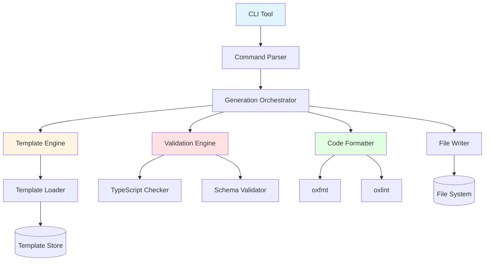

# Design Document: Coding Speed Improvements

## Overview

The Coding Speed Improvements feature provides a comprehensive code generation and scaffolding system for the Dyad/Kiro Electron application. This system automates repetitive coding tasks by generating boilerplate code for IPC endpoints, React components, database schemas, E2E tests, and more. The design follows a template-driven approach with strong validation, automatic formatting, and integration with existing project patterns.

### Goals

1. **Reduce Development Time**: Eliminate manual boilerplate creation for common patterns
2. **Ensure Consistency**: Generate code that follows project conventions and best practices
3. **Improve Code Quality**: Automatically format, lint, and type-check generated code
4. **Enable Customization**: Support template customization for project-specific needs
5. **Provide Safety**: Validate generated code and provide dry-run capabilities

### Non-Goals

1. **AI-Powered Code Generation**: This is template-based generation, not LLM-based
2. **Runtime Code Generation**: All generation happens at development time
3. **Visual Code Builders**: This is a CLI-first tool, not a GUI builder
4. **Cross-Project Templates**: Templates are specific to this Electron/React/TypeScript stack

## Architecture

### High-Level Architecture



### System Layers

1. **CLI Layer**: Command-line interface for user interaction
2. **Orchestration Layer**: Coordinates generation workflow
3. **Template Layer**: Manages and processes code templates
4. **Validation Layer**: Ensures generated code quality
5. **Formatting Layer**: Applies code formatting and linting
6. **File System Layer**: Handles file I/O operations

## Components and Interfaces

### 1. CLI Tool (`scripts/codegen.ts`)

**Purpose**: Entry point for all code generation commands

**Commands**:

- `codegen ipc <name>` - Generate IPC endpoint
- `codegen component <name>` - Generate React component
- `codegen schema <table>` - Generate database schema
- `codegen test <feature>` - Generate E2E test
- `codegen snippet <type>` - Insert code snippet
- `codegen refactor rename-ipc <old> <new>` - Rename IPC endpoint
- `codegen refactor rename-component <old> <new>` - Rename component
- `codegen docs generate` - Generate documentation

**Interface**:

```typescript
interface CLICommand {
  name: string;
  description: string;
  options: CLIOption[];
  action: (args: Record<string, unknown>) => Promise<void>;
}

interface CLIOption {
  name: string;
  description: string;
  required: boolean;
  type: "string" | "boolean" | "number";
  default?: unknown;
}
```

### 2. Generation Orchestrator (`src/codegen/orchestrator.ts`)

**Purpose**: Coordinates the generation workflow

**Interface**:

```typescript
interface GenerationOrchestrator {
  generate(request: GenerationRequest): Promise<GenerationResult>;
}

interface GenerationRequest {
  type: "ipc" | "component" | "schema" | "test";
  name: string;
  options: GenerationOptions;
  dryRun: boolean;
}

interface GenerationOptions {
  // IPC-specific
  domain?: string;
  inputSchema?: string;
  outputSchema?: string;
  isMutation?: boolean;

  // Component-specific
  withStory?: boolean;
  withTest?: boolean;
  baseUI?: boolean;

  // Schema-specific
  columns?: ColumnDefinition[];
  relations?: RelationDefinition[];

  // Test-specific
  testType?: "e2e" | "unit";
  fixtures?: string[];
}

interface GenerationResult {
  success: boolean;
  files: GeneratedFile[];
  errors: ValidationError[];
  warnings: string[];
}

interface GeneratedFile {
  path: string;
  content: string;
  action: "create" | "update" | "skip";
}
```

### 3. Template Engine (`src/codegen/template-engine.ts`)

**Purpose**: Processes templates with variable substitution

**Interface**:

```typescript
interface TemplateEngine {
  loadTemplate(name: string): Promise<Template>;
  render(template: Template, context: TemplateContext): string;
  validateTemplate(template: Template): ValidationResult;
}

interface Template {
  name: string;
  content: string;
  variables: TemplateVariable[];
  conditionals: ConditionalSection[];
}

interface TemplateVariable {
  name: string;
  type: "string" | "boolean" | "array";
  required: boolean;
  default?: unknown;
  transform?: (value: unknown) => string;
}

interface ConditionalSection {
  condition: string;
  content: string;
}

interface TemplateContext {
  [key: string]: unknown;
}
```

**Template Syntax**:

```typescript
// Variable substitution: {{variableName}}
// Conditional: {{#if condition}}...{{/if}}
// Loop: {{#each items}}...{{/each}}
// Transform: {{variableName | pascalCase}}
```

### 4. Validation Engine (`src/codegen/validator.ts`)

**Purpose**: Validates generated code

**Interface**:

```typescript
interface ValidationEngine {
  validateTypeScript(code: string): Promise<ValidationResult>;
  validateSchema(schema: string): Promise<ValidationResult>;
  validateImports(code: string, projectRoot: string): Promise<ValidationResult>;
  validateNaming(
    name: string,
    type: "ipc" | "component" | "schema",
  ): ValidationResult;
}

interface ValidationResult {
  valid: boolean;
  errors: ValidationError[];
  warnings: string[];
}

interface ValidationError {
  message: string;
  line?: number;
  column?: number;
  file?: string;
  severity: "error" | "warning";
}
```

### 5. Code Formatter (`src/codegen/formatter.ts`)

**Purpose**: Formats and lints generated code

**Interface**:

```typescript
interface CodeFormatter {
  format(code: string, filePath: string): Promise<FormattedCode>;
  lint(code: string, filePath: string): Promise<LintResult>;
  fix(code: string, filePath: string): Promise<string>;
}

interface FormattedCode {
  code: string;
  changed: boolean;
}

interface LintResult {
  errors: LintError[];
  warnings: LintWarning[];
  fixable: boolean;
}
```

### 6. Refactoring Engine (`src/codegen/refactor.ts`)

**Purpose**: Automates code refactoring

**Interface**:

```typescript
interface RefactoringEngine {
  renameIPC(oldName: string, newName: string): Promise<RefactorResult>;
  renameComponent(oldName: string, newName: string): Promise<RefactorResult>;
  updateReferences(oldPath: string, newPath: string): Promise<RefactorResult>;
}

interface RefactorResult {
  success: boolean;
  filesChanged: string[];
  errors: string[];
}
```

### 7. Documentation Generator (`src/codegen/docs-generator.ts`)

**Purpose**: Generates documentation from code

**Interface**:

```typescript
interface DocumentationGenerator {
  generateIPCDocs(contracts: IPCContract[]): Promise<string>;
  generateComponentDocs(components: ComponentInfo[]): Promise<string>;
  extractJSDoc(filePath: string): Promise<JSDocComment[]>;
}

interface JSDocComment {
  name: string;
  description: string;
  params: ParamDoc[];
  returns?: string;
  examples: string[];
}
```

### 8. Configuration Parser (`src/codegen/config-parser.ts`)

**Purpose**: Parses and formats configuration files

**Interface**:

```typescript
interface ConfigurationParser {
  parse(content: string): Promise<Configuration>;
  print(config: Configuration): string;
  validate(config: Configuration): ValidationResult;
}

interface Configuration {
  templates: TemplateConfig;
  naming: NamingConfig;
  paths: PathConfig;
  formatting: FormattingConfig;
}
```

## Data Models

### Template Configuration

```typescript
interface TemplateConfig {
  directory: string;
  ipc: {
    contract: string;
    handler: string;
    hook: string;
    test: string;
  };
  component: {
    component: string;
    test: string;
    story: string;
  };
  schema: {
    schema: string;
    migration: string;
  };
  test: {
    e2e: string;
    unit: string;
  };
}
```

### Naming Configuration

```typescript
interface NamingConfig {
  ipc: {
    contractSuffix: string; // e.g., "Contract"
    handlerSuffix: string; // e.g., "Handler"
    hookPrefix: string; // e.g., "use"
  };
  component: {
    suffix: string; // e.g., "" or "Component"
    testSuffix: string; // e.g., ".test"
    storySuffix: string; // e.g., ".stories"
  };
  schema: {
    tableSuffix: string; // e.g., "Table"
  };
}
```

### Path Configuration

```typescript
interface PathConfig {
  ipc: {
    contracts: string; // e.g., "src/ipc/types"
    handlers: string; // e.g., "src/ipc/handlers"
    hooks: string; // e.g., "src/hooks"
  };
  components: string; // e.g., "src/components"
  schemas: string; // e.g., "src/db"
  tests: {
    e2e: string; // e.g., "e2e-tests"
    unit: string; // e.g., "src/__tests__"
  };
}
```

### Generation Context

```typescript
interface IPCGenerationContext {
  name: string; // e.g., "getUser"
  domain: string; // e.g., "user"
  channelName: string; // e.g., "user:get"
  contractName: string; // e.g., "GetUserContract"
  handlerName: string; // e.g., "getUserHandler"
  hookName: string; // e.g., "useGetUser"
  inputSchema: string;
  outputSchema: string;
  isMutation: boolean;
  errorHandling: "DyadError" | "Error";
}

interface ComponentGenerationContext {
  name: string; // e.g., "UserProfile"
  fileName: string; // e.g., "UserProfile.tsx"
  testFileName: string; // e.g., "UserProfile.test.tsx"
  storyFileName: string; // e.g., "UserProfile.stories.tsx"
  props: PropDefinition[];
  baseUI: boolean;
  accessibility: boolean;
}

interface SchemaGenerationContext {
  tableName: string; // e.g., "users"
  schemaName: string; // e.g., "usersTable"
  columns: ColumnDefinition[];
  relations: RelationDefinition[];
  indexes: IndexDefinition[];
}
```

## Implementation Approach

### Phase 1: Core Infrastructure (Weeks 1-2)

1. **CLI Framework Setup**
   - Set up command-line argument parsing
   - Implement interactive prompts
   - Add dry-run mode
   - Create help documentation

2. **Template Engine**
   - Implement template loader
   - Build variable substitution engine
   - Add conditional rendering
   - Support template inheritance

3. **File System Operations**
   - Create file writer with safety checks
   - Implement backup mechanism
   - Add conflict detection
   - Support atomic operations

### Phase 2: Code Generators (Weeks 3-4)

1. **IPC Endpoint Generator**
   - Create IPC contract templates
   - Generate handler boilerplate
   - Create React Query hook templates
   - Generate E2E test scaffolds
   - Implement DyadError integration

2. **React Component Generator**
   - Create component templates
   - Generate test file templates
   - Create Storybook story templates
   - Add Base UI integration
   - Include accessibility attributes

3. **Database Schema Generator**
   - Create Drizzle schema templates
   - Integrate with drizzle-kit
   - Generate migration files
   - Add conflict detection

### Phase 3: Validation & Formatting (Week 5)

1. **Validation Engine**
   - Implement TypeScript validation
   - Add import resolution checking
   - Create naming convention validator
   - Build schema validator

2. **Code Formatting**
   - Integrate oxfmt
   - Integrate oxlint with auto-fix
   - Add TypeScript type checking
   - Provide fix suggestions

### Phase 4: Advanced Features (Weeks 6-7)

1. **Refactoring Tools**
   - Implement IPC endpoint renaming
   - Add component renaming
   - Create reference updater
   - Integrate with git mv

2. **Snippet Library**
   - Create snippet templates
   - Implement snippet insertion
   - Add placeholder navigation
   - Support custom snippets

3. **Documentation Generator**
   - Extract JSDoc comments
   - Generate markdown documentation
   - Create API reference
   - Add auto-update on changes

### Phase 5: Configuration & Polish (Week 8)

1. **Configuration System**
   - Implement config parser
   - Add config validation
   - Support config inheritance
   - Create default configs

2. **Testing & Documentation**
   - Write unit tests
   - Create E2E tests
   - Write user documentation
   - Create video tutorials

## Correctness Properties

_A property is a characteristic or behavior that should hold true across all valid executions of a system—essentially, a formal statement about what the system should do. Properties serve as the bridge between human-readable specifications and machine-verifiable correctness guarantees._

### Property 1: Configuration Round-Trip Preservation

_For any_ valid Configuration object, parsing its printed representation then parsing again SHALL produce an equivalent Configuration object.

**Validates: Requirements 11.4**

### Property 2: Template Variable Escaping

_For any_ template context containing special characters (quotes, backslashes, newlines), rendering the template SHALL properly escape these characters to produce syntactically valid code.

**Validates: Requirements 5.3**

### Property 3: Generated Code Type Validity

_For any_ generated TypeScript file, running TypeScript type checking SHALL either succeed or produce errors that are reported to the user (the generator SHALL NOT produce silently invalid TypeScript).

**Validates: Requirements 7.4, 1.7, 2.7**

### Property 4: IPC Endpoint Connection Consistency

_For any_ generated IPC endpoint, the handler channel name, contract channel name, and hook channel name SHALL all match exactly.

**Validates: Requirements 1.7**

### Property 5: Import Resolution Validity

_For any_ generated file with imports, all import paths SHALL resolve to existing files in the project structure.

**Validates: Requirements 2.7**

### Property 6: Naming Convention Consistency

_For any_ generated code element (IPC, component, schema), the naming SHALL follow the project's established conventions as defined in the configuration.

**Validates: Requirements 1.5, 2.5, 3.3**

### Property 7: Schema Migration Idempotence

_For any_ database schema, generating a migration then applying it then generating again SHALL produce no new migration (the schema is in sync).

**Validates: Requirements 3.6**

### Property 8: Refactoring Reference Completeness

_For any_ renamed code element, all references in the codebase SHALL be updated (no broken references remain).

**Validates: Requirements 9.3, 9.5**

### Property 9: Template Conditional Consistency

_For any_ template with conditional sections, rendering with a context SHALL include or exclude sections based solely on the condition evaluation (no partial rendering).

**Validates: Requirements 5.4**

### Property 10: Documentation Synchronization

_For any_ code file with JSDoc comments, updating the code then regenerating documentation SHALL reflect the current JSDoc content (documentation stays in sync).

**Validates: Requirements 10.5**

## Error Handling

### Error Categories

1. **User Input Errors**
   - Invalid command arguments
   - Missing required parameters
   - Invalid naming conventions
   - **Handling**: Display clear error message, show usage help, exit with code 1

2. **Template Errors**
   - Template not found
   - Invalid template syntax
   - Missing required variables
   - **Handling**: Display template error with line/column, suggest fixes, exit with code 1

3. **Validation Errors**
   - TypeScript type errors
   - Invalid imports
   - Schema validation failures
   - **Handling**: Display validation errors, offer to continue anyway (with warning), exit with code 1 if user declines

4. **File System Errors**
   - File already exists
   - Permission denied
   - Disk full
   - **Handling**: Display error, offer alternatives (overwrite, rename, skip), exit with code 1 if unrecoverable

5. **External Tool Errors**
   - oxfmt failure
   - oxlint failure
   - TypeScript checker failure
   - drizzle-kit failure
   - **Handling**: Display tool output, continue with warning (files still created), exit with code 0

### Error Recovery Strategies

1. **Atomic Operations**: Use temporary files and atomic renames to prevent partial writes
2. **Rollback Support**: Keep backups of modified files for rollback on failure
3. **Graceful Degradation**: Continue with warnings if non-critical steps fail (formatting, linting)
4. **Detailed Logging**: Log all operations for debugging and audit trails

### Error Messages

Error messages should follow this format:

```
[ERROR] <Category>: <Message>

<Details>

Suggestion: <How to fix>
```

Example:

```
[ERROR] Template Error: Missing required variable 'inputSchema'

Template: ipc-contract.ts.template
Line: 15
Variable: {{inputSchema}}

Suggestion: Provide the --input-schema option or use interactive mode
```

## Testing Strategy

### Unit Testing

**Focus Areas**:

1. **Template Engine**
   - Variable substitution correctness
   - Conditional rendering logic
   - Template validation
   - Error handling

2. **Configuration Parser**
   - Parsing valid configurations
   - Handling invalid syntax
   - Pretty printing
   - Round-trip preservation

3. **Validation Engine**
   - Naming convention validation
   - Import resolution
   - Schema validation
   - TypeScript validation integration

4. **Utility Functions**
   - Path manipulation
   - String transformations (camelCase, PascalCase, kebab-case)
   - File system helpers

**Testing Approach**:

- Use Vitest for unit tests
- Mock file system operations using in-memory implementations
- Mock external tools (oxfmt, oxlint, TypeScript)
- Test error conditions and edge cases
- Aim for 80%+ code coverage on core logic

### Property-Based Testing

**Property Tests** (using fast-check):

1. **Configuration Round-Trip** (Property 1)

   ```typescript
   test("configuration round-trip preserves structure", () => {
     fc.assert(
       fc.property(configurationArbitrary, (config) => {
         const printed = configParser.print(config);
         const parsed = configParser.parse(printed);
         expect(parsed).toEqual(config);
       }),
       { numRuns: 100 },
     );
   });
   ```

2. **Template Variable Escaping** (Property 2)

   ```typescript
   test("template rendering escapes special characters", () => {
     fc.assert(
       fc.property(
         fc.record({
           name: fc.string(),
           value: fc.string(),
         }),
         (context) => {
           const template = { content: '{{name}}: "{{value}}"', variables: [] };
           const rendered = templateEngine.render(template, context);
           // Should be valid TypeScript
           expect(() => parseTypeScript(rendered)).not.toThrow();
         },
       ),
       { numRuns: 100 },
     );
   });
   ```

3. **IPC Channel Name Consistency** (Property 4)

   ```typescript
   test("IPC generation produces consistent channel names", () => {
     fc.assert(
       fc.property(
         fc.record({
           name: fc.string().filter(isValidIdentifier),
           domain: fc.string().filter(isValidIdentifier),
         }),
         (params) => {
           const result = ipcGenerator.generate(params);
           const contract = extractChannelName(result.contract);
           const handler = extractChannelName(result.handler);
           const hook = extractChannelName(result.hook);
           expect(contract).toBe(handler);
           expect(handler).toBe(hook);
         },
       ),
       { numRuns: 100 },
     );
   });
   ```

4. **Naming Convention Consistency** (Property 6)

   ```typescript
   test("generated names follow conventions", () => {
     fc.assert(
       fc.property(fc.string().filter(isValidIdentifier), (name) => {
         const componentName = namingUtils.toComponentName(name);
         expect(componentName).toMatch(/^[A-Z][a-zA-Z0-9]*$/);

         const hookName = namingUtils.toHookName(name);
         expect(hookName).toMatch(/^use[A-Z][a-zA-Z0-9]*$/);
       }),
       { numRuns: 100 },
     );
   });
   ```

**Property Test Configuration**:

- Minimum 100 iterations per property test
- Each test tagged with: **Feature: coding-speed-improvements, Property {number}: {property_text}**
- Use custom arbitraries for domain-specific types (identifiers, file paths, schemas)

### Integration Testing

**Focus Areas**:

1. **End-to-End Generation**
   - Generate IPC endpoint and verify all files created
   - Generate React component with test and story
   - Generate database schema and migration
   - Generate E2E test with fixtures

2. **External Tool Integration**
   - Verify oxfmt actually formats generated code
   - Verify oxlint runs and reports issues
   - Verify TypeScript checker detects type errors
   - Verify drizzle-kit generates migrations

3. **Refactoring Operations**
   - Rename IPC endpoint and verify all references updated
   - Rename component and verify imports updated
   - Verify git mv preserves history

**Testing Approach**:

- Use temporary directories for file operations
- Run actual external tools (not mocked)
- Verify generated files compile and pass linting
- Clean up temporary files after tests

### E2E Testing

**Test Scenarios**:

1. **Happy Path**: Generate IPC endpoint from CLI, verify it works in the app
2. **Error Handling**: Provide invalid input, verify error messages
3. **Dry Run**: Run with --dry-run, verify no files created
4. **Interactive Mode**: Test interactive prompts
5. **Refactoring**: Rename endpoint, verify app still works

**Testing Approach**:

- Use Playwright for CLI interaction testing
- Verify generated code integrates with existing codebase
- Test against real project structure
- One or two comprehensive E2E tests (not many small ones)

### Test Organization

```
src/codegen/
  __tests__/
    unit/
      template-engine.test.ts
      config-parser.test.ts
      validator.test.ts
      naming-utils.test.ts
    property/
      config-roundtrip.property.test.ts
      template-escaping.property.test.ts
      ipc-consistency.property.test.ts
      naming-conventions.property.test.ts
    integration/
      ipc-generation.integration.test.ts
      component-generation.integration.test.ts
      schema-generation.integration.test.ts
      refactoring.integration.test.ts

e2e-tests/
  codegen.spec.ts
```

### Testing Checklist

Before merging:

- [ ] All unit tests pass
- [ ] All property tests pass (100 iterations each)
- [ ] All integration tests pass
- [ ] E2E tests pass
- [ ] Generated code passes `npm run ts`
- [ ] Generated code passes `npm run lint`
- [ ] Generated code passes `npm run fmt:check`
- [ ] Manual testing of CLI commands
- [ ] Documentation updated

## Dependencies

### New Dependencies

1. **Template Engine**: Consider using Handlebars or Mustache for template processing
   - Alternative: Build custom lightweight template engine
2. **CLI Framework**: Use Commander.js or Yargs for CLI parsing
   - Alternative: Use Node.js built-in `process.argv` parsing

3. **AST Manipulation**: Use Babel or TypeScript Compiler API for refactoring
   - Required for accurate reference finding and updating

### Existing Dependencies

- **Zod**: For schema validation (already in project)
- **TypeScript**: For type checking (already in project)
- **oxfmt**: For code formatting (already in project)
- **oxlint**: For linting (already in project)
- **drizzle-kit**: For database migrations (already in project)
- **fast-check**: For property-based testing (already in project)
- **Vitest**: For unit testing (already in project)

## Security Considerations

1. **Path Traversal**: Validate all file paths to prevent writing outside project directory
2. **Code Injection**: Sanitize all user input before template substitution
3. **Command Injection**: Validate parameters passed to external tools
4. **File Permissions**: Respect file system permissions, fail gracefully on permission errors
5. **Backup Safety**: Create backups before modifying existing files

## Performance Considerations

1. **Template Caching**: Cache loaded templates to avoid repeated file reads
2. **Parallel Generation**: Generate multiple files in parallel when possible
3. **Incremental Validation**: Only validate changed files, not entire project
4. **Lazy Loading**: Load templates and tools only when needed
5. **Progress Feedback**: Show progress for long-running operations

## Future Enhancements

1. **VS Code Extension**: Integrate code generation into VS Code
2. **Watch Mode**: Auto-regenerate on template changes
3. **Custom Generators**: Allow users to create custom generators
4. **AI-Assisted Generation**: Use LLM to suggest template improvements
5. **Migration Tools**: Tools to migrate from old patterns to new patterns
6. **Batch Operations**: Generate multiple related items at once
7. **Undo Support**: Undo last generation operation
8. **Template Marketplace**: Share templates with community

## Open Questions

1. **Template Language**: Should we use an existing template engine (Handlebars) or build custom?
   - **Recommendation**: Start with Handlebars for faster development, consider custom later if needed

2. **Configuration Format**: JSON, YAML, or TypeScript?
   - **Recommendation**: TypeScript for type safety and IDE support

3. **CLI vs GUI**: Should we build a GUI in addition to CLI?
   - **Recommendation**: Start with CLI, add GUI later if demand exists

4. **Integration Point**: Should this be a separate tool or integrated into the app?
   - **Recommendation**: Separate CLI tool for development time, not runtime

5. **Template Versioning**: How to handle template updates across versions?
   - **Recommendation**: Version templates with the tool, provide migration guides

## Success Metrics

1. **Time Savings**: Measure time to create IPC endpoint before/after (target: 80% reduction)
2. **Code Quality**: Measure lint errors in generated vs hand-written code (target: 50% fewer errors)
3. **Adoption Rate**: Track usage of code generation commands (target: 80% of new features use codegen)
4. **Error Rate**: Track generation failures and validation errors (target: <5% failure rate)
5. **Developer Satisfaction**: Survey developers on tool usefulness (target: 4/5 rating)

## Conclusion

The Coding Speed Improvements feature will significantly accelerate development by automating repetitive coding tasks. The template-driven approach ensures consistency while remaining flexible enough for customization. Strong validation and formatting integration maintain code quality, while property-based testing ensures correctness of core functionality. The phased implementation approach allows for iterative development and early feedback.
