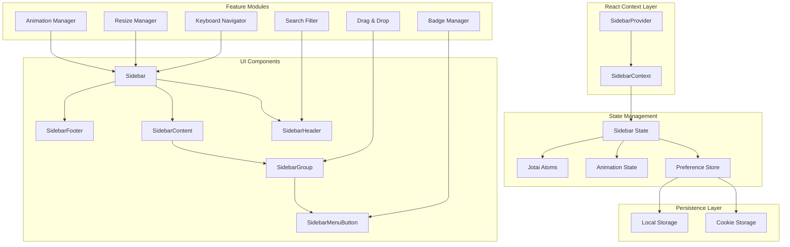
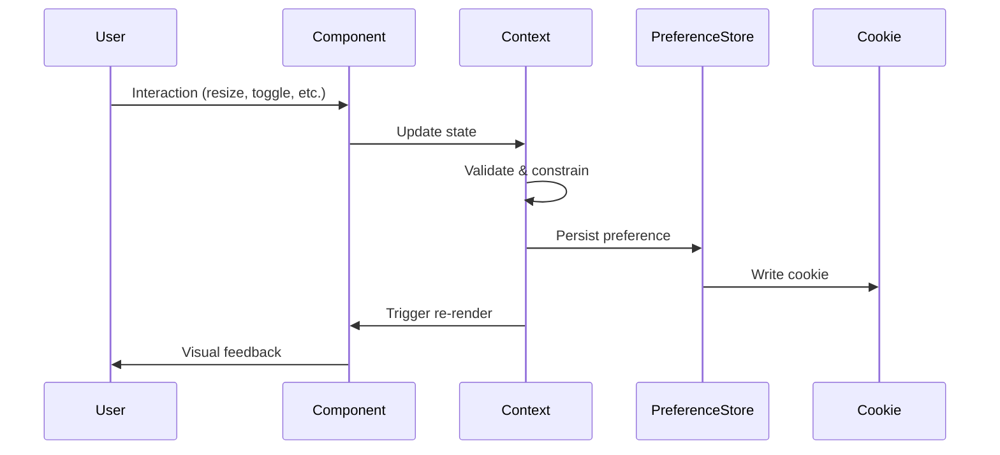
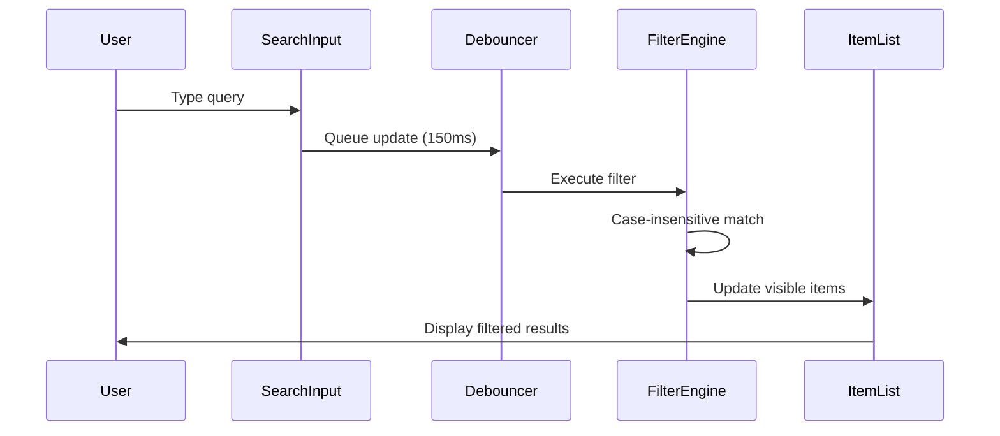
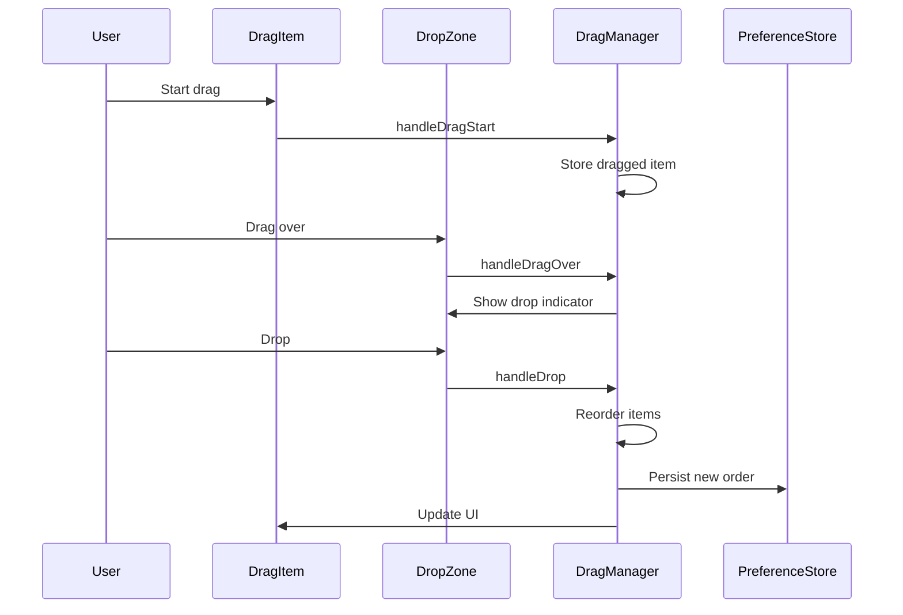

# Design Document: Sidebar Improvements

## Overview

This design enhances the existing sidebar component with smooth animations, user customization, accessibility improvements, and advanced features while maintaining backward compatibility. The sidebar is a critical navigation component in the Electron application that currently supports basic icon-based collapsed mode and hover-to-expand functionality.

### Design Goals

1. **Smooth User Experience**: Implement 60fps animations using CSS transforms for all state transitions
2. **User Customization**: Enable width resizing, icon size selection, and theme variants with persistent preferences
3. **Enhanced Accessibility**: Full WCAG 2.1 AA compliance with keyboard navigation and screen reader support
4. **Advanced Features**: Search/filter, drag-and-drop reordering, badge notifications, and nested groups
5. **Performance**: Maintain responsiveness with virtualized rendering and React.memo optimization
6. **Backward Compatibility**: Preserve existing SidebarProvider API and integration points

### Technical Constraints

- Must work with TanStack Router Link components
- Must integrate with existing Jotai atoms (dropdownOpenAtom)
- Must use cookie-based persistence (same mechanism as current implementation)
- Must support existing hover-to-expand behavior
- Must use TypeScript strict mode
- Must maintain 60fps animation performance

## Architecture

### High-Level Architecture



### Component Hierarchy

```
SidebarProvider (Context Provider)
└── Sidebar (Main Container)
    ├── SidebarHeader
    │   ├── SidebarTrigger
    │   └── SearchFilter (new)
    ├── SidebarContent
    │   ├── RecentItemsSection (new)
    │   ├── PinnedItemsSection (new)
    │   └── SidebarGroup
    │       ├── SidebarGroupLabel
    │       ├── SidebarGroupAction
    │       └── SidebarMenu
    │           └── SidebarMenuItem
    │               ├── SidebarMenuButton
    │               ├── SidebarMenuBadge (enhanced)
    │               └── SidebarMenuSub (collapsible)
    ├── SidebarFooter
    └── SidebarRail (resize handle)
```

## Components and Interfaces

### Core Context Interface

```typescript
interface SidebarContextProps {
  // Existing properties (backward compatible)
  state: "expanded" | "collapsed";
  open: boolean;
  setOpen: (open: boolean) => void;
  toggleSidebar: () => void;

  // New properties
  width: number;
  setWidth: (width: number) => void;
  iconSize: IconSize;
  setIconSize: (size: IconSize) => void;
  theme: ThemeVariant;
  setTheme: (theme: ThemeVariant) => void;
  isResizing: boolean;
  searchQuery: string;
  setSearchQuery: (query: string) => void;
  recentItems: string[];
  addRecentItem: (itemId: string) => void;
  pinnedItems: string[];
  togglePinItem: (itemId: string) => void;
  itemOrder: string[];
  reorderItems: (newOrder: string[]) => void;
  expandedGroups: Set<string>;
  toggleGroup: (groupId: string) => void;
}

type IconSize = "small" | "medium" | "large";
type ThemeVariant = "minimal" | "modern" | "compact";

interface SidebarPreferences {
  width: number;
  iconSize: IconSize;
  theme: ThemeVariant;
  itemOrder: string[];
  pinnedItems: string[];
  expandedGroups: string[];
  recentItems: string[];
}
```

### Animation Manager

```typescript
interface AnimationConfig {
  duration: number;
  timingFunction: string;
  property: string;
}

interface AnimationManager {
  // Transition configurations
  sidebarTransition: AnimationConfig;
  hoverTransition: AnimationConfig;
  iconTransition: AnimationConfig;

  // Animation state
  isAnimating: boolean;
  animationQueue: Animation[];

  // Methods
  startAnimation(element: HTMLElement, config: AnimationConfig): Promise<void>;
  cancelAnimation(element: HTMLElement): void;
  measurePerformance(): { fps: number; dropCount: number };
}
```

### Resize Manager

```typescript
interface ResizeManager {
  minWidth: number; // 15rem = 240px
  maxWidth: number; // 30rem = 480px
  currentWidth: number;
  isDragging: boolean;

  startResize(event: MouseEvent): void;
  handleResize(event: MouseEvent): void;
  endResize(): void;
  constrainWidth(width: number): number;
}
```

### Search Filter

```typescript
interface SearchFilterProps {
  value: string;
  onChange: (value: string) => void;
  debounceMs: number;
  placeholder: string;
  onClear: () => void;
}

interface SearchFilter {
  filterItems(items: NavigationItem[], query: string): NavigationItem[];
  highlightMatch(text: string, query: string): React.ReactNode;
}
```

### Keyboard Navigator

```typescript
interface KeyboardNavigator {
  focusedIndex: number;
  items: NavigationItem[];

  handleKeyDown(event: KeyboardEvent): void;
  focusNext(): void;
  focusPrevious(): void;
  focusFirst(): void;
  focusLast(): void;
  activateFocused(): void;
}

interface KeyboardShortcuts {
  toggleSidebar: string; // "Cmd/Ctrl+B"
  search: string; // "Cmd/Ctrl+K"
  clearSearch: string; // "Escape"
  nextItem: string[]; // ["Tab", "ArrowDown"]
  previousItem: string[]; // ["Shift+Tab", "ArrowUp"]
  activate: string; // "Enter"
}
```

### Drag and Drop Manager

```typescript
interface DragDropManager {
  draggedItem: NavigationItem | null;
  dropTarget: NavigationItem | null;
  dragOverIndex: number;

  handleDragStart(item: NavigationItem, event: DragEvent): void;
  handleDragOver(index: number, event: DragEvent): void;
  handleDrop(event: DragEvent): void;
  handleDragEnd(): void;

  reorderItems(fromIndex: number, toIndex: number): NavigationItem[];
}
```

### Badge Manager

```typescript
interface BadgeConfig {
  itemId: string;
  count: number;
  variant: "default" | "accent" | "warning";
  pulse: boolean;
}

interface BadgeManager {
  badges: Map<string, BadgeConfig>;

  setBadge(itemId: string, count: number, variant?: string): void;
  clearBadge(itemId: string): void;
  getBadge(itemId: string): BadgeConfig | undefined;
  formatCount(count: number): string; // "99+" for count >= 100
}
```

## Data Models

### Preference Storage Schema

```typescript
// Cookie storage (existing pattern)
interface CookiePreferences {
  sidebar_state: boolean; // existing
  sidebar_width: number; // new
  sidebar_icon_size: IconSize; // new
  sidebar_theme: ThemeVariant; // new
}

// LocalStorage for complex data
interface LocalStoragePreferences {
  sidebar_item_order: string[];
  sidebar_pinned_items: string[];
  sidebar_expanded_groups: string[];
  sidebar_recent_items: string[];
}

// Serialization format
const PREFERENCE_KEYS = {
  ITEM_ORDER: "sidebar_item_order",
  PINNED_ITEMS: "sidebar_pinned_items",
  EXPANDED_GROUPS: "sidebar_expanded_groups",
  RECENT_ITEMS: "sidebar_recent_items",
} as const;
```

### Navigation Item Model

```typescript
interface NavigationItem {
  id: string;
  title: string;
  to: string;
  icon: React.ComponentType;
  badge?: number;
  children?: NavigationItem[];
  isPinned?: boolean;
  isRecent?: boolean;
  order?: number;
}

interface NavigationGroup {
  id: string;
  label: string;
  items: NavigationItem[];
  isExpanded: boolean;
  isCollapsible: boolean;
}
```

### Animation State Model

```typescript
interface AnimationState {
  isExpanding: boolean;
  isCollapsing: boolean;
  isHovering: boolean;
  isResizing: boolean;
  currentFrame: number;
  targetFrame: number;
  startTime: number;
  duration: number;
}

interface PerformanceMetrics {
  fps: number;
  frameDrops: number;
  animationDuration: number;
  renderTime: number;
}
```

## Data Flow

### State Update Flow



### Search Filter Flow



### Drag and Drop Flow


