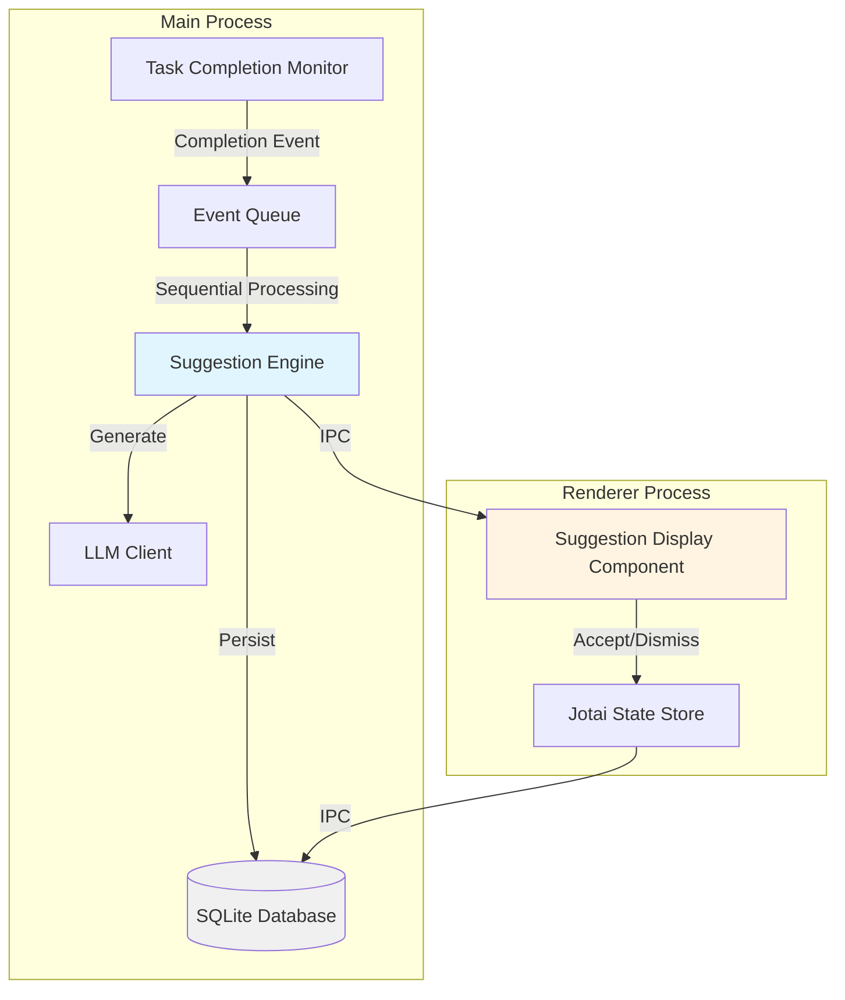
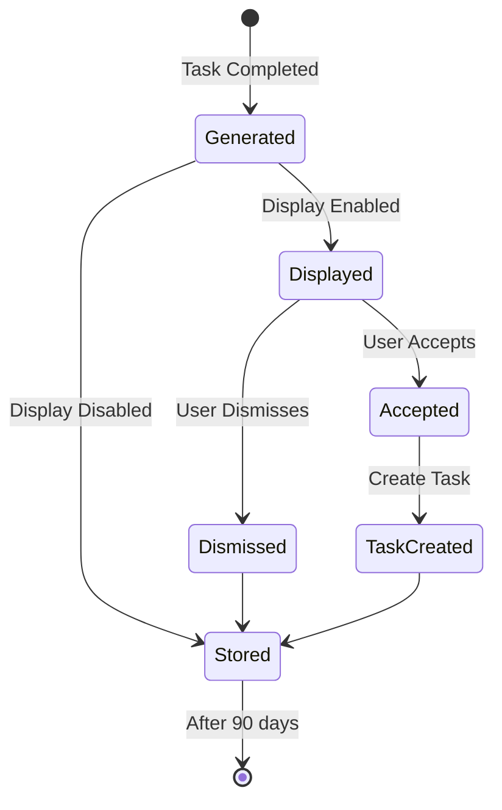
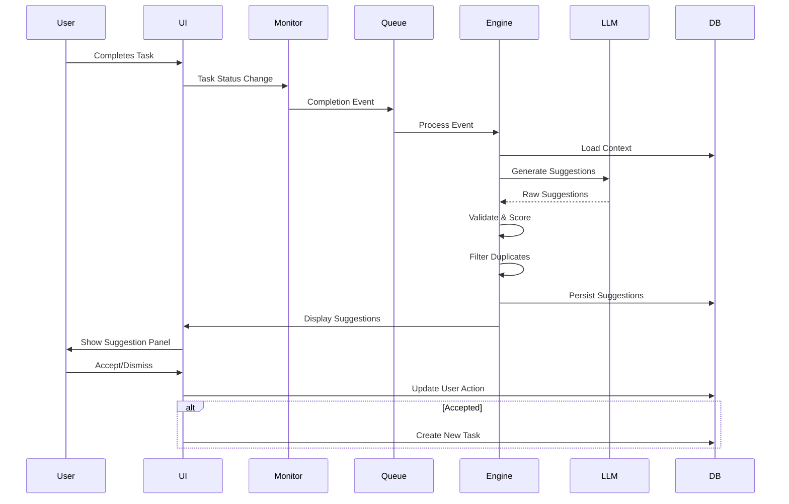

# Design Document: Task Completion Suggestions

## Overview

The Task Completion Suggestions feature provides intelligent, context-aware recommendations to users immediately after they complete tasks in the spec workflow system. The system analyzes completed tasks using an LLM-powered suggestion engine and presents categorized suggestions (new features, bug fixes, improvements) through a non-intrusive UI component.

### Key Capabilities

- **Automatic Detection**: Monitors task status changes and triggers suggestion generation within 100ms
- **Contextual Analysis**: Examines task descriptions, modified files, spec type, and related tasks to generate relevant suggestions
- **Intelligent Categorization**: Classifies suggestions into "new feature", "bug fix", or "improvement" categories
- **Priority Scoring**: Assigns relevance scores (1-10) to help users focus on high-impact suggestions
- **User Actions**: Supports accepting suggestions (creates new tasks) or dismissing them
- **Persistent History**: Maintains a 90-day history of all suggestions and user actions
- **Customizable Behavior**: Configurable display settings and suggestion limits
- **Graceful Error Handling**: Continues normal operation even when suggestion generation fails

### Design Goals

1. **Non-Disruptive**: Suggestions enhance workflow without blocking or interrupting the user
2. **Relevant**: LLM-powered analysis ensures suggestions align with project context and goals
3. **Actionable**: Each suggestion is specific enough to be immediately converted into a task
4. **Performant**: Event processing and UI updates happen within strict time constraints
5. **Resilient**: System handles failures gracefully and maintains normal operation

## Architecture

### System Components



### Component Responsibilities

#### Task Completion Monitor

- Watches for task status changes to "completed"
- Emits completion events with task context
- Ensures events are delivered within 100ms

#### Event Queue

- Buffers completion events during high-frequency task completions
- Processes events sequentially to prevent race conditions
- Preserves task completion order

#### Suggestion Engine

- Core analysis and generation logic
- Extracts task context (description, files, spec type, related tasks)
- Calls LLM with structured prompts
- Validates and scores generated suggestions
- Filters duplicates and existing tasks
- Persists suggestions to database

#### LLM Client

- Interfaces with AI SDK (`streamText` or `generateText`)
- Uses configured language model from user settings
- Handles timeouts (5 second limit)
- Provides structured output parsing

#### Suggestion Display Component

- React component using Base UI primitives
- Displays suggestions in a dismissible panel
- Shows category badges, descriptions, and priority indicators
- Provides Accept/Dismiss actions
- Updates within 500ms of receiving suggestions

#### Jotai State Store

- Manages suggestion display state
- Tracks user interactions (accept/dismiss)
- Coordinates IPC calls for persistence

## Components and Interfaces

### Database Schema

```typescript
// New table: task_completion_suggestions
export const taskCompletionSuggestions = sqliteTable(
  "task_completion_suggestions",
  {
    id: integer("id").primaryKey({ autoIncrement: true }),

    // Task context
    taskId: text("task_id").notNull(),
    taskDescription: text("task_description").notNull(),
    specType: text("spec_type", {
      enum: ["feature", "bugfix", "other"],
    }).notNull(),
    specPath: text("spec_path").notNull(),

    // Suggestion content
    category: text("category", {
      enum: ["new_feature", "bug_fix", "improvement"],
    }).notNull(),
    description: text("description").notNull(),
    priorityScore: integer("priority_score").notNull(), // 1-10

    // User action
    userAction: text("user_action", {
      enum: ["pending", "accepted", "dismissed"],
    })
      .notNull()
      .default("pending"),
    actionTimestamp: integer("action_timestamp", { mode: "timestamp" }),

    // Metadata
    createdAt: integer("created_at", { mode: "timestamp" })
      .notNull()
      .default(sql`(unixepoch())`),

    // Optional: created task ID if accepted
    createdTaskId: text("created_task_id"),
  },
);

// Settings table extension (add to existing settings)
export const suggestionSettings = {
  enabled: boolean("suggestion_generation_enabled").default(true),
  displayEnabled: boolean("suggestion_display_enabled").default(true),
  maxSuggestionsPerTask: integer("max_suggestions_per_task").default(5), // 1-10
};
```

### IPC Contracts

```typescript
// src/ipc/contracts/suggestion_contracts.ts
import { z } from "zod";
import { createIpcContract } from "./core";

const SuggestionCategory = z.enum(["new_feature", "bug_fix", "improvement"]);
const UserAction = z.enum(["pending", "accepted", "dismissed"]);

const SuggestionSchema = z.object({
  id: z.number(),
  taskId: z.string(),
  taskDescription: z.string(),
  specType: z.enum(["feature", "bugfix", "other"]),
  specPath: z.string(),
  category: SuggestionCategory,
  description: z.string().min(20),
  priorityScore: z.number().int().min(1).max(10),
  userAction: UserAction,
  actionTimestamp: z.date().nullable(),
  createdAt: z.date(),
  createdTaskId: z.string().nullable(),
});

export type Suggestion = z.infer<typeof SuggestionSchema>;

// Generate suggestions for a completed task
export const generateSuggestions = createIpcContract({
  channel: "suggestions:generate",
  input: z.object({
    taskId: z.string(),
    taskDescription: z.string(),
    specPath: z.string(),
    specType: z.enum(["feature", "bugfix", "other"]),
    modifiedFiles: z.array(z.string()),
    relatedTasks: z.array(
      z.object({
        id: z.string(),
        description: z.string(),
        status: z.string(),
      }),
    ),
  }),
  output: z.object({
    suggestions: z.array(SuggestionSchema),
    error: z.string().nullable(),
  }),
});

// Accept a suggestion (creates a new task)
export const acceptSuggestion = createIpcContract({
  channel: "suggestions:accept",
  input: z.object({
    suggestionId: z.number(),
    specPath: z.string(),
  }),
  output: z.object({
    taskId: z.string(),
    success: z.boolean(),
  }),
});

// Dismiss a suggestion
export const dismissSuggestion = createIpcContract({
  channel: "suggestions:dismiss",
  input: z.object({
    suggestionId: z.number(),
  }),
  output: z.object({
    success: z.boolean(),
  }),
});

// Retrieve suggestion history
export const getSuggestionHistory = createIpcContract({
  channel: "suggestions:getHistory",
  input: z.object({
    taskId: z.string().optional(),
    startDate: z.date().optional(),
    endDate: z.date().optional(),
    limit: z.number().int().positive().default(50),
  }),
  output: z.object({
    suggestions: z.array(SuggestionSchema),
  }),
});

// Get/update suggestion settings
export const getSuggestionSettings = createIpcContract({
  channel: "suggestions:getSettings",
  input: z.object({}),
  output: z.object({
    enabled: z.boolean(),
    displayEnabled: z.boolean(),
    maxSuggestionsPerTask: z.number().int().min(1).max(10),
  }),
});

export const updateSuggestionSettings = createIpcContract({
  channel: "suggestions:updateSettings",
  input: z.object({
    enabled: z.boolean().optional(),
    displayEnabled: z.boolean().optional(),
    maxSuggestionsPerTask: z.number().int().min(1).max(10).optional(),
  }),
  output: z.object({
    success: z.boolean(),
  }),
});
```

### Suggestion Engine Interface

```typescript
// src/ipc/handlers/suggestion_engine.ts
export interface TaskContext {
  taskId: string;
  taskDescription: string;
  specPath: string;
  specType: "feature" | "bugfix" | "other";
  modifiedFiles: string[];
  relatedTasks: Array<{
    id: string;
    description: string;
    status: string;
  }>;
}

export interface GeneratedSuggestion {
  category: "new_feature" | "bug_fix" | "improvement";
  description: string;
  priorityScore: number; // 1-10
  reasoning?: string; // Optional: why this suggestion was made
}

export interface SuggestionEngineResult {
  suggestions: GeneratedSuggestion[];
  error: string | null;
  processingTimeMs: number;
}

export class SuggestionEngine {
  constructor(
    private llmClient: LanguageModel,
    private db: Database,
  ) {}

  async generateSuggestions(
    context: TaskContext,
    timeoutMs: number = 5000,
  ): Promise<SuggestionEngineResult>;

  async filterDuplicates(
    suggestions: GeneratedSuggestion[],
    taskId: string,
  ): Promise<GeneratedSuggestion[]>;

  async filterExistingTasks(
    suggestions: GeneratedSuggestion[],
    specPath: string,
  ): Promise<GeneratedSuggestion[]>;

  async persistSuggestions(
    suggestions: GeneratedSuggestion[],
    context: TaskContext,
  ): Promise<Suggestion[]>;
}
```

### React Component Interface

```typescript
// src/renderer/components/SuggestionDisplay.tsx
export interface SuggestionDisplayProps {
  taskId: string;
  specPath: string;
  onClose: () => void;
}

export interface SuggestionCardProps {
  suggestion: Suggestion;
  onAccept: (suggestionId: number) => Promise<void>;
  onDismiss: (suggestionId: number) => Promise<void>;
}

// Jotai atoms for state management
export const suggestionsAtom = atom<Suggestion[]>([]);
export const suggestionLoadingAtom = atom<boolean>(false);
export const suggestionErrorAtom = atom<string | null>(null);
```

## Data Models

### Suggestion Lifecycle States



### Data Flow



## Correctness Properties

_A property is a characteristic or behavior that should hold true across all valid executions of a system—essentially, a formal statement about what the system should do. Properties serve as the bridge between human-readable specifications and machine-verifiable correctness guarantees._

### Property 1: Event Order Preservation

_For any_ sequence of task completion events, the processing order SHALL match the input order, ensuring that suggestions are generated in the same sequence as tasks were completed.

**Validates: Requirements 1.3, 1.4**

### Property 2: Context Extraction Completeness

_For any_ task completion event, the Suggestion Engine SHALL extract all required context fields (task description, modified files, spec type, related tasks), and none of these fields SHALL be null or empty when the source data is available.

**Validates: Requirements 1.2, 9.1, 9.2, 9.3, 9.4**

### Property 3: Suggestion Category Validity

_For any_ generated suggestion, the category field SHALL be exactly one of the valid values: "new_feature", "bug_fix", or "improvement".

**Validates: Requirements 2.2, 4.1**

### Property 4: Suggestion Description Length

_For any_ generated suggestion, the description field SHALL contain at least 20 characters.

**Validates: Requirements 2.3**

### Property 5: Priority Score Range

_For any_ generated suggestion, the priority score SHALL be an integer in the range [1, 10] inclusive.

**Validates: Requirements 10.4**

### Property 6: Priority-Based Ordering

_For any_ list of suggestions returned to the user, the suggestions SHALL be ordered in descending priority score order (highest priority first).

**Validates: Requirements 2.4, 10.5**

### Property 7: Suggestion Uniqueness

_For any_ task completion event, all generated suggestions for that task SHALL be unique (no duplicate descriptions or semantically identical suggestions).

**Validates: Requirements 10.2**

### Property 8: Persistence Round-Trip

_For any_ suggestion that is persisted to the database, retrieving it by ID SHALL return a suggestion with all fields matching the original values (task ID, description, category, priority score, timestamps).

**Validates: Requirements 6.1, 6.4**

### Property 9: Query by Task ID

_For any_ task ID with associated suggestions, querying suggestions by that task ID SHALL return all and only the suggestions associated with that task.

**Validates: Requirements 6.2**

### Property 10: Date Range Filtering

_For any_ date range query, all returned suggestions SHALL have creation timestamps within the specified range (inclusive of start, exclusive of end).

**Validates: Requirements 6.3**

### Property 11: User Action Recording

_For any_ accept or dismiss action on a suggestion, the system SHALL record the action type and timestamp, and subsequent retrieval of that suggestion SHALL reflect the recorded action.

**Validates: Requirements 3.5, 5.5**

### Property 12: Accept Creates Task

_For any_ accepted suggestion, the system SHALL create a new task with a description derived from the suggestion, and the suggestion record SHALL be updated with the created task ID.

**Validates: Requirements 5.3**

### Property 13: Dismiss Removes from Display

_For any_ dismissed suggestion, subsequent queries for pending suggestions SHALL not include the dismissed suggestion.

**Validates: Requirements 5.4**

### Property 14: UI Action Presence

_For any_ displayed suggestion, the rendered UI SHALL include both an "Accept" action and a "Dismiss" action.

**Validates: Requirements 5.1, 5.2**

### Property 15: Display Count Constraint

_For any_ suggestion display operation, the number of suggestions shown SHALL be between 1 and the configured maximum (1-10), even if more suggestions were generated.

**Validates: Requirements 3.3**

### Property 16: Settings Validation

_For any_ attempt to set maxSuggestionsPerTask, values outside the range [1, 10] SHALL be rejected, and values within the range SHALL be accepted and persisted.

**Validates: Requirements 8.4**

### Property 17: Settings Effect on Subsequent Operations

_For any_ change to suggestion settings, all task completions occurring after the settings change SHALL use the new settings values.

**Validates: Requirements 8.5**

### Property 18: Error Logging with Context

_For any_ suggestion generation failure, the system SHALL log an error message that includes the task ID and task description from the completion event.

**Validates: Requirements 7.1**

### Property 19: Error State Display

_For any_ suggestion generation failure or timeout, the UI SHALL display an appropriate error message (either "suggestions unavailable" or "suggestions took too long").

**Validates: Requirements 7.2, 7.4**

### Property 20: System Resilience After Failure

_For any_ suggestion generation failure, the system SHALL successfully process the next task completion event without error.

**Validates: Requirements 7.5**

## Error Handling

### Error Categories

The system handles errors using the `DyadError` classification system:

#### Validation Errors (`DyadErrorKind.Validation`)

- Invalid task context (missing required fields)
- Invalid suggestion data (description too short, invalid category)
- Invalid settings values (maxSuggestionsPerTask out of range)
- **User Impact**: Error message shown in UI, operation rejected
- **Recovery**: User corrects input and retries

#### External Errors (`DyadErrorKind.External`)

- LLM API failures (network issues, rate limits, service unavailable)
- LLM timeout (exceeds 5 second limit)
- **User Impact**: "Suggestions unavailable" message shown
- **Recovery**: Automatic retry on next task completion

#### Internal Errors (`DyadErrorKind.Internal`)

- Database write failures
- Unexpected exceptions in suggestion engine
- **User Impact**: "Suggestions unavailable" message shown
- **Recovery**: Error logged, system continues normal operation

### Error Handling Strategy

```typescript
// Suggestion generation with comprehensive error handling
async function handleTaskCompletion(context: TaskContext): Promise<void> {
  try {
    // Validate input
    const validated = TaskContextSchema.parse(context);

    // Check if generation is enabled
    const settings = await getSuggestionSettings();
    if (!settings.enabled) {
      logger.info(`Suggestion generation disabled for task ${context.taskId}`);
      return;
    }

    // Generate with timeout
    const result = await Promise.race([
      suggestionEngine.generateSuggestions(validated),
      timeout(5000, "Suggestion generation timeout"),
    ]);

    if (result.error) {
      throw new DyadError(
        `Failed to generate suggestions: ${result.error}`,
        DyadErrorKind.External,
      );
    }

    // Persist suggestions
    await suggestionEngine.persistSuggestions(result.suggestions, validated);

    // Display if enabled
    if (settings.displayEnabled) {
      await displaySuggestions(result.suggestions);
    }
  } catch (error) {
    if (error instanceof z.ZodError) {
      logger.error(`Invalid task context for ${context.taskId}:`, error);
      throw new DyadError(
        `Invalid task context: ${error.message}`,
        DyadErrorKind.Validation,
      );
    }

    if (error instanceof DyadError) {
      logger.error(
        `Suggestion generation failed for ${context.taskId}:`,
        error,
      );
      // Don't re-throw - system continues normal operation
      await notifyUserOfError(error.kind);
    } else {
      logger.error(`Unexpected error for ${context.taskId}:`, error);
      throw new DyadError(
        `Unexpected error: ${error instanceof Error ? error.message : String(error)}`,
        DyadErrorKind.Internal,
      );
    }
  }
}
```

### Timeout Handling

```typescript
function timeout<T>(ms: number, message: string): Promise<T> {
  return new Promise((_, reject) => {
    setTimeout(() => {
      reject(new DyadError(message, DyadErrorKind.External));
    }, ms);
  });
}
```

### User-Facing Error Messages

```typescript
function getErrorMessage(kind: DyadErrorKind, context: string): string {
  switch (kind) {
    case DyadErrorKind.External:
      return context.includes("timeout")
        ? "Suggestions took too long to generate. Please try again."
        : "Suggestions are currently unavailable. Please try again later.";
    case DyadErrorKind.Validation:
      return "Unable to generate suggestions due to invalid task data.";
    case DyadErrorKind.Internal:
      return "An unexpected error occurred. Suggestions are unavailable.";
    default:
      return "Suggestions are currently unavailable.";
  }
}
```

## Testing Strategy

### Dual Testing Approach

The feature requires both property-based testing and example-based unit testing for comprehensive coverage:

#### Property-Based Tests (PBT)

Property-based tests verify universal properties across randomized inputs using the `fast-check` library. Each property test runs a minimum of 100 iterations.

**Test Configuration:**

```typescript
import fc from "fast-check";

// Minimum 100 iterations per property test
const testConfig = { numRuns: 100 };

// Tag format for traceability
// Feature: task-completion-suggestions, Property {number}: {property_text}
```

**Property Test Coverage:**

1. **Event Order Preservation** (Property 1)
   - Generate random sequences of completion events
   - Verify processing order matches input order
   - Tag: `Feature: task-completion-suggestions, Property 1: Event order preservation`

2. **Context Extraction Completeness** (Property 2)
   - Generate random task completion events with varying context
   - Verify all required fields are extracted
   - Tag: `Feature: task-completion-suggestions, Property 2: Context extraction completeness`

3. **Suggestion Category Validity** (Property 3)
   - Generate random suggestions
   - Verify category is one of valid enum values
   - Tag: `Feature: task-completion-suggestions, Property 3: Suggestion category validity`

4. **Suggestion Description Length** (Property 4)
   - Generate random suggestions
   - Verify description length >= 20 characters
   - Tag: `Feature: task-completion-suggestions, Property 4: Suggestion description length`

5. **Priority Score Range** (Property 5)
   - Generate random suggestions
   - Verify priority score in [1, 10]
   - Tag: `Feature: task-completion-suggestions, Property 5: Priority score range`

6. **Priority-Based Ordering** (Property 6)
   - Generate random suggestion lists
   - Verify descending priority order
   - Tag: `Feature: task-completion-suggestions, Property 6: Priority-based ordering`

7. **Suggestion Uniqueness** (Property 7)
   - Generate random suggestions for a task
   - Verify no duplicates
   - Tag: `Feature: task-completion-suggestions, Property 7: Suggestion uniqueness`

8. **Persistence Round-Trip** (Property 8)
   - Generate random suggestions, persist, retrieve
   - Verify all fields match
   - Tag: `Feature: task-completion-suggestions, Property 8: Persistence round-trip`

9. **Query by Task ID** (Property 9)
   - Generate random tasks with suggestions
   - Verify query returns correct suggestions
   - Tag: `Feature: task-completion-suggestions, Property 9: Query by task ID`

10. **Date Range Filtering** (Property 10)
    - Generate random suggestions with timestamps
    - Verify date range queries return correct results
    - Tag: `Feature: task-completion-suggestions, Property 10: Date range filtering`

11. **User Action Recording** (Property 11)
    - Generate random accept/dismiss actions
    - Verify actions are persisted correctly
    - Tag: `Feature: task-completion-suggestions, Property 11: User action recording`

12. **Accept Creates Task** (Property 12)
    - Generate random suggestions, accept them
    - Verify tasks are created with correct content
    - Tag: `Feature: task-completion-suggestions, Property 12: Accept creates task`

13. **Dismiss Removes from Display** (Property 13)
    - Generate random suggestions, dismiss them
    - Verify they don't appear in pending queries
    - Tag: `Feature: task-completion-suggestions, Property 13: Dismiss removes from display`

14. **UI Action Presence** (Property 14)
    - Generate random suggestions
    - Verify rendered UI contains Accept and Dismiss actions
    - Tag: `Feature: task-completion-suggestions, Property 14: UI action presence`

15. **Display Count Constraint** (Property 15)
    - Generate suggestion lists of varying sizes
    - Verify display respects max count setting
    - Tag: `Feature: task-completion-suggestions, Property 15: Display count constraint`

16. **Settings Validation** (Property 16)
    - Generate random setting values
    - Verify validation accepts valid range, rejects invalid
    - Tag: `Feature: task-completion-suggestions, Property 16: Settings validation`

17. **Settings Effect on Subsequent Operations** (Property 17)
    - Generate random setting changes
    - Verify subsequent operations use new settings
    - Tag: `Feature: task-completion-suggestions, Property 17: Settings effect on subsequent operations`

18. **Error Logging with Context** (Property 18)
    - Simulate random failures
    - Verify error logs contain task context
    - Tag: `Feature: task-completion-suggestions, Property 18: Error logging with context`

19. **Error State Display** (Property 19)
    - Simulate failures and timeouts
    - Verify appropriate error messages are displayed
    - Tag: `Feature: task-completion-suggestions, Property 19: Error state display`

20. **System Resilience After Failure** (Property 20)
    - Simulate random failures
    - Verify system processes next event successfully
    - Tag: `Feature: task-completion-suggestions, Property 20: System resilience after failure`

#### Example-Based Unit Tests

Unit tests cover specific scenarios, edge cases, and integration points:

**Unit Test Coverage:**

1. **Event Detection**
   - Task status change triggers completion event
   - Event delivered within 100ms (integration test)
   - Multiple rapid completions are queued

2. **LLM Integration**
   - Successful suggestion generation with mock LLM
   - LLM timeout handling (5 second limit)
   - LLM error response handling
   - Structured output parsing

3. **Duplicate Filtering**
   - Identical suggestions are deduplicated
   - Similar suggestions to existing tasks are filtered
   - Case-insensitive comparison

4. **UI Component Rendering**
   - Suggestion panel displays correctly
   - Category badges render with distinct styles
   - Priority indicators show correct values
   - Accept/Dismiss buttons are functional

5. **Settings Management**
   - Settings can be read and updated
   - Display enabled/disabled affects UI visibility
   - Generation enabled/disabled affects engine execution
   - Max suggestions setting is enforced

6. **Database Operations**
   - Suggestions are persisted correctly
   - History queries return correct results
   - 90-day retention policy (integration test)
   - Concurrent access handling

7. **Edge Cases**
   - Empty suggestion list (no relevant suggestions)
   - Task with no modified files
   - Task with no related tasks
   - Spec with no existing tasks

### E2E Testing

End-to-end tests verify the complete user workflow:

1. **Happy Path**
   - User completes a task
   - Suggestions appear within 500ms
   - User accepts a suggestion
   - New task is created in spec

2. **Dismissal Flow**
   - User completes a task
   - Suggestions appear
   - User dismisses all suggestions
   - Suggestions are marked as dismissed in history

3. **Settings Configuration**
   - User disables suggestion display
   - User completes a task
   - No suggestions are shown (but generated in background)
   - User re-enables display
   - Next task completion shows suggestions

4. **Error Recovery**
   - LLM service is unavailable
   - User completes a task
   - Error message is shown
   - LLM service recovers
   - Next task completion succeeds

### Test File Organization

```
src/
  ipc/
    handlers/
      __tests__/
        suggestion_handlers.test.ts          # IPC handler unit tests
        suggestion_engine.test.ts            # Engine logic unit tests
        suggestion_engine.property.test.ts   # Property-based tests
  renderer/
    components/
      __tests__/
        SuggestionDisplay.test.tsx           # Component unit tests
        SuggestionDisplay.property.test.tsx  # Component property tests
e2e-tests/
  suggestions/
    suggestion-workflow.spec.ts              # E2E tests
```

### Mocking Strategy

- **LLM Client**: Mock `streamText` responses for deterministic testing
- **Database**: Use in-memory SQLite for unit tests
- **IPC**: Mock IPC channels for renderer component tests
- **Time**: Mock `Date.now()` for timestamp testing

---

**Document Version**: 1.0  
**Last Updated**: 2025-01-28  
**Status**: Ready for Review
