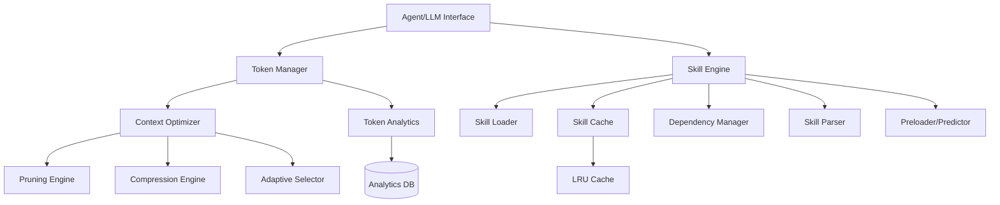

# Design Document: Token Optimization and Skills Performance

## Overview

This design document outlines the technical architecture for optimizing token usage and improving skills performance in the Dyad/Kiro Electron application. The system introduces intelligent context management, compression techniques, and skill caching to reduce LLM API costs while maintaining or improving response quality.

### Goals

1. **Reduce Token Consumption**: Minimize tokens sent to LLM APIs through intelligent pruning and compression
2. **Improve Skills Performance**: Optimize skill loading, execution, and caching for faster response times
3. **Maintain Quality**: Ensure optimizations don't degrade response quality or task completion rates
4. **Provide Visibility**: Give users and developers insights into token usage and optimization effectiveness

### Key Design Decisions

- **Layered Optimization**: Apply multiple optimization strategies (pruning, compression, adaptive selection) in sequence
- **Preserve User Intent**: Always prioritize user-provided content over automatically discovered content
- **Lazy Loading**: Load skills and their dependencies only when needed
- **LRU Caching**: Use Least Recently Used caching for skills and execution results
- **Async Operations**: Perform all optimization and loading operations asynchronously to avoid blocking the main thread

## Architecture

### High-Level Architecture



### Component Responsibilities

**Token Manager**

- Allocates and tracks token budgets per request
- Triggers optimization when thresholds are exceeded
- Collects usage analytics and generates reports
- Validates budgets against model limits

**Context Optimizer**

- Coordinates pruning, compression, and adaptive selection
- Ensures user-provided content is preserved
- Manages context window utilization

**Pruning Engine**

- Removes duplicate code blocks
- Strips verbose logging and debug statements
- Removes non-semantic comments
- Prioritizes recent conversation turns

**Compression Engine**

- Extracts function signatures from large files
- Summarizes verbose documentation
- Replaces repeated patterns with references
- Measures compression ratios

**Adaptive Selector**

- Ranks files by relevance to current task
- Selects appropriate context based on available window
- Uses semantic similarity for relevance scoring

**Skill Engine**

- Manages skill lifecycle (load, execute, unload)
- Coordinates caching and dependency management
- Provides parsing and formatting utilities

**Skill Loader**

- Loads skill metadata without full content
- Implements lazy loading for skill content
- Measures and reports loading times

**Skill Cache (LRU)**

- Caches frequently used skills
- Implements time-based eviction (10-minute idle timeout)
- Caches execution results for deterministic skills

**Dependency Manager**

- Resolves skill dependencies
- Detects circular dependencies
- Shares common dependencies between skills
- Invalidates cache when dependencies change

**Preloader/Predictor**

- Analyzes usage patterns
- Predicts next skills needed
- Preloads skills during idle time

## Components and Interfaces

### Token Manager

```typescript
interface TokenManager {
  /**
   * Allocate a token budget for a request based on task complexity
   */
  allocateBudget(request: AgentRequest): TokenBudget;

  /**
   * Check if optimization should be triggered
   */
  shouldOptimize(usage: TokenUsage, budget: TokenBudget): boolean;

  /**
   * Validate a budget adjustment against model limits
   */
  validateBudget(budget: number, modelType: string): ValidationResult;

  /**
   * Track token consumption for a request
   */
  trackUsage(requestId: string, usage: TokenUsage): void;

  /**
   * Get usage statistics
   */
  getStatistics(filter: StatisticsFilter): UsageStatistics;

  /**
   * Export usage data
   */
  exportData(format: "csv" | "json"): Promise<string>;
}

interface TokenBudget {
  total: number;
  used: number;
  remaining: number;
  warningThreshold: number; // 80%
  criticalThreshold: number; // 90%
}

interface TokenUsage {
  requestId: string;
  timestamp: number;
  inputTokens: number;
  outputTokens: number;
  totalTokens: number;
  modelType: string;
  conversationId?: string;
  skillName?: string;
}
```

### Context Optimizer

```typescript
interface ContextOptimizer {
  /**
   * Optimize context to fit within budget
   */
  optimize(context: Context, budget: TokenBudget): OptimizedContext;

  /**
   * Prune context by removing redundant information
   */
  prune(context: Context): PrunedContext;

  /**
   * Compress context using various techniques
   */
  compress(context: Context): CompressedContext;

  /**
   * Select most relevant context sections
   */
  selectRelevant(context: Context, task: string, budget: number): Context;
}

interface Context {
  userInstructions: string[];
  conversationHistory: ConversationTurn[];
  files: FileContext[];
  skills: SkillContext[];
  metadata: ContextMetadata;
}

interface OptimizedContext extends Context {
  originalTokenCount: number;
  optimizedTokenCount: number;
  compressionRatio: number;
  optimizationsApplied: string[];
  debugInfo?: OptimizationDebugInfo;
}
```

### Pruning Engine

```typescript
interface PruningEngine {
  /**
   * Remove duplicate code blocks
   */
  removeDuplicates(context: Context): Context;

  /**
   * Remove verbose logging statements
   */
  removeLogging(code: string): string;

  /**
   * Remove non-semantic comments
   */
  removeComments(code: string, language: string): string;

  /**
   * Prioritize recent conversation turns
   */
  prioritizeRecent(
    turns: ConversationTurn[],
    maxTurns: number,
  ): ConversationTurn[];
}
```

### Compression Engine

```typescript
interface CompressionEngine {
  /**
   * Extract function signatures from large files
   */
  extractSignatures(file: FileContext): FileContext;

  /**
   * Summarize verbose documentation
   */
  summarizeDocumentation(doc: string): string;

  /**
   * Replace repeated patterns with references
   */
  deduplicatePatterns(context: Context): Context;

  /**
   * Measure compression effectiveness
   */
  measureCompression(
    original: Context,
    compressed: Context,
  ): CompressionMetrics;
}

interface CompressionMetrics {
  originalTokens: number;
  compressedTokens: number;
  compressionRatio: number;
  tokensSaved: number;
  techniquesApplied: string[];
}
```

### Skill Engine

```typescript
interface SkillEngine {
  /**
   * Load skill metadata without full content
   */
  loadMetadata(skillName: string): Promise<SkillMetadata>;

  /**
   * Load skill with dependencies
   */
  loadSkill(skillName: string): Promise<Skill>;

  /**
   * Execute a skill
   */
  executeSkill(
    skillName: string,
    context: ExecutionContext,
  ): Promise<SkillResult>;

  /**
   * Unload skill from memory
   */
  unloadSkill(skillName: string): void;

  /**
   * Parse skill file
   */
  parseSkill(content: string): ParseResult<Skill>;

  /**
   * Format skill object to file
   */
  formatSkill(skill: Skill): string;

  /**
   * Validate skill against schema
   */
  validateSkill(skill: Skill): ValidationResult;

  /**
   * Estimate token count for skill
   */
  estimateTokens(skill: Skill): number;
}

interface SkillMetadata {
  name: string;
  description: string;
  dependencies: string[];
  estimatedTokens: number;
  scope: "user" | "workspace";
  lastModified: number;
}

interface SkillCache {
  /**
   * Get skill from cache
   */
  get(skillName: string): Skill | undefined;

  /**
   * Put skill in cache
   */
  put(skillName: string, skill: Skill): void;

  /**
   * Check if skill is cached
   */
  has(skillName: string): boolean;

  /**
   * Remove skill from cache
   */
  evict(skillName: string): void;

  /**
   * Clear all cached skills
   */
  clear(): void;

  /**
   * Get cache statistics
   */
  getStats(): CacheStats;
}

interface CacheStats {
  size: number;
  hits: number;
  misses: number;
  hitRate: number;
  evictions: number;
}
```

### Dependency Manager

```typescript
interface DependencyManager {
  /**
   * Resolve all dependencies for a skill
   */
  resolveDependencies(skillName: string): Promise<string[]>;

  /**
   * Detect circular dependencies
   */
  detectCircular(skillName: string): CircularDependencyError | null;

  /**
   * Get dependency graph
   */
  getDependencyGraph(): DependencyGraph;

  /**
   * Invalidate cache for dependent skills
   */
  invalidateDependents(skillName: string): void;

  /**
   * Validate all dependencies are available
   */
  validateDependencies(skillName: string): ValidationResult;
}

interface DependencyGraph {
  nodes: DependencyNode[];
  edges: DependencyEdge[];
}

interface DependencyNode {
  skillName: string;
  metadata: SkillMetadata;
}

interface DependencyEdge {
  from: string;
  to: string;
  type: "requires" | "optional";
}
```

## Data Models

### Token Budget Model

```typescript
interface TokenBudgetConfig {
  modelType: string;
  contextWindow: number;
  maxOutputTokens: number;
  defaultBudget: number;
  warningThreshold: number; // 0.8
  criticalThreshold: number; // 0.9
}

interface TokenAllocation {
  requestId: string;
  budget: TokenBudget;
  allocated: number;
  timestamp: number;
  taskComplexity: "simple" | "medium" | "complex";
}
```

### Skill Model Extensions

```typescript
interface EnhancedSkill extends Skill {
  metadata: SkillMetadata;
  dependencies: SkillDependency[];
  cacheInfo: CacheInfo;
  performanceMetrics: SkillPerformanceMetrics;
}

interface SkillDependency {
  name: string;
  version?: string;
  optional: boolean;
}

interface CacheInfo {
  cached: boolean;
  lastAccessed: number;
  accessCount: number;
  cacheKey: string;
}

interface SkillPerformanceMetrics {
  averageLoadTime: number;
  averageExecutionTime: number;
  cacheHitRate: number;
  lastExecutionTime: number;
}
```

### Analytics Model

```typescript
interface TokenAnalytics {
  conversationId: string;
  totalTokens: number;
  inputTokens: number;
  outputTokens: number;
  optimizationsSaved: number;
  costEstimate: number;
  timestamp: number;
}

interface SkillAnalytics {
  skillName: string;
  executionCount: number;
  totalExecutionTime: number;
  averageExecutionTime: number;
  cacheHitRate: number;
  errorRate: number;
  lastUsed: number;
}

interface OptimizationAnalytics {
  technique: string;
  applicationsCount: number;
  totalTokensSaved: number;
  averageCompressionRatio: number;
  successRate: number;
}
```

## Correctness Properties

_A property is a characteristic or behavior that should hold true across all valid executions of a system—essentially, a formal statement about what the system should do. Properties serve as the bridge between human-readable specifications and machine-verifiable correctness guarantees._

### Property Reflection

After analyzing all acceptance criteria, I've identified the following areas of potential redundancy:

1. **Token Budget Thresholds**: Requirements 3.2 (90% threshold) and 1.1 (80% threshold) test similar threshold logic and can be combined into a single property about threshold-based triggering.

2. **Skill Loading/Unloading**: Requirements 4.1, 4.2, and 4.7 all relate to skill loading behavior and can be consolidated into properties about lazy loading and idempotence.

3. **Cache Performance**: Requirements 5.6 and 5.7 both test caching behavior and can be combined into a single property about cache effectiveness.

4. **Dependency Management**: Requirements 6.1, 6.2, and 6.5 all test dependency validation and can be consolidated.

5. **Skill Parsing Round-Trip**: Requirements 12.1, 12.3, 12.4, and 12.5 all relate to parsing/formatting and should be combined into a single round-trip property.

The following properties represent the unique, non-redundant validation requirements:

### Property 1: Context Optimization Threshold Triggering

_For any_ context and token budget, when the context exceeds the warning threshold (80%) or critical threshold (90%) of the budget, the Context_Optimizer SHALL trigger the appropriate optimization level.

**Validates: Requirements 1.1, 3.2**

### Property 2: User Content Preservation

_For any_ context containing user-provided instructions, after optimization the optimized context SHALL contain all user-provided instructions unchanged.

**Validates: Requirements 1.2**

### Property 3: Duplicate Code Removal

_For any_ context containing duplicate code blocks, after pruning the pruned context SHALL contain each unique code block exactly once.

**Validates: Requirements 1.3**

### Property 4: Logging Statement Removal

_For any_ code containing logging statements (console.log, logger.debug, etc.), after pruning the pruned code SHALL not contain logging statements.

**Validates: Requirements 1.4**

### Property 5: Non-Semantic Comment Removal

_For any_ file with comments, after pruning the pruned file SHALL not contain comments that don't add semantic value (e.g., "// end of function", "// TODO").

**Validates: Requirements 1.5**

### Property 6: Recent Turn Prioritization

_For any_ conversation history, when pruning is necessary the pruned history SHALL preserve more recent turns than older turns.

**Validates: Requirements 1.6**

### Property 7: Large File Signature Extraction

_For any_ code file larger than 500 lines, after compression the compressed file SHALL contain only function/class signatures without implementation details.

**Validates: Requirements 2.1**

### Property 8: Pattern Deduplication

_For any_ context containing repeated patterns, after compression the compressed context SHALL replace repeated patterns with references.

**Validates: Requirements 2.3**

### Property 9: Compression Ratio Measurement

_For any_ context, after compression the compression metrics SHALL accurately reflect the ratio of compressed tokens to original tokens.

**Validates: Requirements 2.5**

### Property 10: Budget Rejection

_For any_ request that exceeds its allocated token budget, the Token_Manager SHALL reject the request with a descriptive error message.

**Validates: Requirements 3.3**

### Property 11: Token Consumption Tracking

_For any_ conversation, the Token_Manager SHALL accurately track cumulative token consumption across all requests in that conversation.

**Validates: Requirements 3.4**

### Property 12: Model-Specific Budget Limits

_For any_ model type, the Token_Manager SHALL enforce budget limits that do not exceed the model's context window.

**Validates: Requirements 3.6, 3.7**

### Property 13: Lazy Metadata Loading

_For any_ skill, loading metadata SHALL NOT load the full skill content into memory.

**Validates: Requirements 4.1**

### Property 14: Selective Skill Loading

_For any_ skill request, only the requested skill and its declared dependencies SHALL be loaded into memory.

**Validates: Requirements 4.2**

### Property 15: Skill Caching

_For any_ skill accessed multiple times, subsequent accesses SHALL retrieve the skill from cache rather than reloading from disk.

**Validates: Requirements 4.3**

### Property 16: Loading Time Measurement

_For any_ skill load operation, the Skill_Engine SHALL measure and report the loading time.

**Validates: Requirements 4.6**

### Property 17: Load-Unload-Reload Idempotence

_For any_ skill, unloading then reloading SHALL restore the same functionality (same metadata, content, and behavior).

**Validates: Requirements 4.7**

### Property 18: Execution Context Reuse

_For any_ skill executed multiple times, the Skill_Engine SHALL reuse execution contexts when possible.

**Validates: Requirements 5.1**

### Property 19: Concurrency Limiting

_For any_ set of concurrent skill execution requests, the Skill_Engine SHALL limit concurrent executions to prevent resource exhaustion.

**Validates: Requirements 5.4**

### Property 20: Execution Error Reporting

_For any_ skill execution failure, the Skill_Engine SHALL provide detailed error information including execution time.

**Validates: Requirements 5.5**

### Property 21: Deterministic Result Caching

_For any_ deterministic skill executed with identical inputs, subsequent executions SHALL return cached results.

**Validates: Requirements 5.6**

### Property 22: Cache Performance

_For any_ cached skill result, retrieval time SHALL be less than 10% of the original execution time.

**Validates: Requirements 5.7**

### Property 23: Dependency Load Ordering

_For any_ skill with dependencies, all dependencies SHALL be loaded before the skill itself is loaded.

**Validates: Requirements 6.1**

### Property 24: Circular Dependency Detection

_For any_ skill with circular dependencies, the Dependency_Manager SHALL detect the circular dependency and reject the skill.

**Validates: Requirements 6.2**

### Property 25: Dependency Sharing

_For any_ set of skills with common dependencies, the common dependencies SHALL be loaded once and shared between skills.

**Validates: Requirements 6.3**

### Property 26: Cache Invalidation on Dependency Update

_For any_ skill dependency that is updated, all dependent skills in the cache SHALL be invalidated.

**Validates: Requirements 6.4**

### Property 27: Dependency Availability Validation

_For any_ skill, before execution all declared dependencies SHALL be validated as available.

**Validates: Requirements 6.5**

### Property 28: Usage Recording with Timestamps

_For any_ token usage event, the Token_Manager SHALL record the usage with an accurate timestamp.

**Validates: Requirements 7.1**

### Property 29: Usage Aggregation

_For any_ set of token usage events, the Token_Manager SHALL correctly aggregate statistics by conversation, skill, and time period.

**Validates: Requirements 7.2**

### Property 30: Top Consumer Identification

_For any_ set of operations, the Token_Manager SHALL correctly identify and rank the top token-consuming operations.

**Validates: Requirements 7.3**

### Property 31: CSV Export Format

_For any_ token usage data, export to CSV SHALL produce a valid CSV file with correct headers and data rows.

**Validates: Requirements 7.5**

### Property 32: Cost Calculation

_For any_ token usage with model pricing, the Token_Manager SHALL calculate cost estimates accurately.

**Validates: Requirements 7.6**

### Property 33: File Relevance Ranking

_For any_ set of files with relevance scores, the Context_Optimizer SHALL rank files in descending order of relevance.

**Validates: Requirements 8.1**

### Property 34: Differential File Inclusion

_For any_ set of files with varying relevance, high-relevance files SHALL be included in full and low-relevance files SHALL be included as summaries.

**Validates: Requirements 8.2**

### Property 35: Conversation Turn Selection

_For any_ long conversation history, the Context_Optimizer SHALL include recent turns and relevant past turns based on semantic similarity.

**Validates: Requirements 8.3**

### Property 36: Semantic Similarity Selection

_For any_ context sections with similarity scores, the Context_Optimizer SHALL select sections with highest similarity to the current task.

**Validates: Requirements 8.4**

### Property 37: User File Prioritization

_For any_ context containing both user-provided and automatically discovered files, user-provided files SHALL be prioritized for inclusion.

**Validates: Requirements 8.5**

### Property 38: Usage Pattern Prediction

_For any_ usage history, the Skill_Engine SHALL predict next skills based on historical patterns.

**Validates: Requirements 9.1**

### Property 39: Preloading Priority

_For any_ set of skills to preload, the Skill_Engine SHALL prioritize based on historical usage frequency.

**Validates: Requirements 9.3**

### Property 40: Preload Utilization

_For any_ preloaded skill that is requested, the Skill_Engine SHALL use the preloaded version immediately without reloading.

**Validates: Requirements 9.5**

### Property 41: Token Estimation

_For any_ skill content, the Skill_Engine SHALL provide a token count estimate within 10% of the actual token count.

**Validates: Requirements 10.1**

### Property 42: Token Limit Warnings

_For any_ skill exceeding recommended token limits, the Skill_Engine SHALL generate a warning.

**Validates: Requirements 10.2**

### Property 43: Redundancy Detection

_For any_ skill with redundant content, the Skill_Engine SHALL detect and report the redundancy.

**Validates: Requirements 10.5**

### Property 44: Context Window Detection

_For any_ model type, the Token_Manager SHALL correctly detect the context window size.

**Validates: Requirements 11.1**

### Property 45: Adaptive Context Inclusion

_For any_ available context window size, the Token_Manager SHALL adjust context inclusion to maximize utilization without exceeding the window.

**Validates: Requirements 11.2, 11.3, 11.5**

### Property 46: Response Token Reservation

_For any_ expected response length, the Token_Manager SHALL reserve appropriate tokens from the context window.

**Validates: Requirements 11.4**

### Property 47: Insufficient Context Feedback

_For any_ task requiring more context than available, the Token_Manager SHALL provide feedback explaining the limitation.

**Validates: Requirements 11.6**

### Property 48: Skill Parsing

_For any_ valid skill file, the Skill_Engine SHALL parse it into a structured Skill object with correct fields.

**Validates: Requirements 12.1**

### Property 49: Parse Error Reporting

_For any_ invalid skill file, the Skill_Engine SHALL return a descriptive error with location information.

**Validates: Requirements 12.2**

### Property 50: Skill Formatting Round-Trip

_For any_ valid Skill object, parsing then formatting then parsing SHALL produce an equivalent Skill object with identical metadata and structure.

**Validates: Requirements 12.3, 12.4, 12.5**

### Property 51: Schema Validation

_For any_ skill file, validation against the schema SHALL occur before parsing.

**Validates: Requirements 12.6**

## Error Handling

### Error Classification

**Token Budget Errors**

- `BUDGET_EXCEEDED`: Request exceeds allocated budget
- `BUDGET_INVALID`: Budget adjustment exceeds model limits
- `OPTIMIZATION_FAILED`: Context optimization failed to reduce tokens sufficiently

**Skill Loading Errors**

- `SKILL_NOT_FOUND`: Requested skill does not exist
- `SKILL_PARSE_ERROR`: Skill file parsing failed
- `SKILL_VALIDATION_ERROR`: Skill validation failed
- `DEPENDENCY_NOT_FOUND`: Required dependency not available
- `CIRCULAR_DEPENDENCY`: Circular dependency detected
- `LOAD_TIMEOUT`: Skill loading exceeded timeout

**Skill Execution Errors**

- `EXECUTION_FAILED`: Skill execution encountered an error
- `EXECUTION_TIMEOUT`: Skill execution exceeded timeout
- `CONTEXT_INVALID`: Execution context is invalid
- `RESOURCE_EXHAUSTED`: System resources exhausted

**Cache Errors**

- `CACHE_FULL`: Cache capacity exceeded
- `CACHE_CORRUPTION`: Cached data is corrupted
- `EVICTION_FAILED`: Cache eviction failed

### Error Handling Strategy

1. **Graceful Degradation**: When optimization fails, fall back to unoptimized context
2. **Detailed Logging**: Log all errors with context for debugging
3. **User Feedback**: Provide actionable error messages to users
4. **Retry Logic**: Implement exponential backoff for transient failures
5. **Circuit Breaker**: Disable failing optimizations temporarily

### Error Response Format

```typescript
interface ErrorResponse {
  code: string;
  message: string;
  details?: Record<string, unknown>;
  timestamp: number;
  requestId?: string;
  recoverable: boolean;
  suggestedAction?: string;
}
```

## Testing Strategy

### Unit Testing

**Token Manager Tests**

- Budget allocation logic
- Threshold calculation
- Usage tracking accuracy
- Statistics aggregation
- Cost calculation

**Context Optimizer Tests**

- Pruning logic
- Compression algorithms
- Relevance ranking
- User content preservation

**Skill Engine Tests**

- Metadata loading
- Dependency resolution
- Cache operations
- Parsing and formatting

**Dependency Manager Tests**

- Circular dependency detection
- Dependency graph construction
- Cache invalidation

### Property-Based Testing

All correctness properties listed above will be implemented as property-based tests using a PBT library appropriate for TypeScript/Node.js (e.g., `fast-check`).

**Configuration**:

- Minimum 100 iterations per property test
- Each test tagged with: `Feature: token-optimization-skills, Property {number}: {property_text}`

**Example Property Test Structure**:

```typescript
import fc from "fast-check";

describe("Feature: token-optimization-skills, Property 3: Duplicate Code Removal", () => {
  it("should remove all duplicate code blocks", () => {
    fc.assert(
      fc.property(
        fc.array(fc.string(), { minLength: 1, maxLength: 10 }),
        (codeBlocks) => {
          // Create context with duplicates
          const context = createContextWithDuplicates(codeBlocks);

          // Prune context
          const pruned = pruningEngine.removeDuplicates(context);

          // Verify each unique block appears exactly once
          const uniqueBlocks = new Set(codeBlocks);
          for (const block of uniqueBlocks) {
            const count = countOccurrences(pruned, block);
            expect(count).toBe(1);
          }
        },
      ),
      { numRuns: 100 },
    );
  });
});
```

### Integration Testing

**End-to-End Optimization Flow**

- Test complete optimization pipeline with real contexts
- Verify task completion after optimization
- Measure actual token savings

**Skill Loading and Execution**

- Test skill loading with real skill files
- Test dependency resolution with complex dependency graphs
- Test cache behavior under load

**Analytics and Reporting**

- Test data collection and aggregation
- Test export functionality
- Test dashboard rendering

### Performance Testing

**Benchmarks**

- Context optimization latency (target: <100ms for typical context)
- Skill loading time (target: <50ms for cached skills)
- Cache hit rate (target: >80% for frequently used skills)
- Compression ratio (target: >30% token reduction)

**Load Testing**

- Concurrent skill executions
- High-frequency token tracking
- Large context optimization

### E2E Testing (Playwright)

**User Workflows**

- Create conversation with token optimization enabled
- Load and execute skills
- View token usage analytics
- Export usage data

**UI Testing**

- Token usage dashboard displays correctly
- Skill management UI works with caching
- Error messages display appropriately

## Implementation Notes

### Technology Choices

**LRU Cache Implementation**

- Use existing `Map`-based cache pattern from codebase (see `src/utils/codebase.ts`)
- Implement time-based eviction with `setTimeout`
- Track access times for LRU ordering

**Token Estimation**

- Continue using existing 4-characters-per-token heuristic
- Consider integrating `tiktoken` library for more accurate counting

**Compression Techniques**

- AST parsing for code signature extraction (use existing TypeScript compiler API)
- Pattern matching for duplicate detection
- Semantic similarity using embeddings (consider lightweight models)

**Async Operations**

- Use `async/await` throughout
- Implement worker threads for CPU-intensive operations (compression, parsing)
- Use IPC for main-renderer communication (follow existing patterns)

### Database Schema

**Token Analytics Table**

```sql
CREATE TABLE token_analytics (
  id INTEGER PRIMARY KEY AUTOINCREMENT,
  request_id TEXT NOT NULL,
  conversation_id TEXT,
  skill_name TEXT,
  timestamp INTEGER NOT NULL,
  input_tokens INTEGER NOT NULL,
  output_tokens INTEGER NOT NULL,
  total_tokens INTEGER NOT NULL,
  model_type TEXT NOT NULL,
  optimizations_saved INTEGER DEFAULT 0,
  cost_estimate REAL
);

CREATE INDEX idx_token_analytics_conversation ON token_analytics(conversation_id);
CREATE INDEX idx_token_analytics_skill ON token_analytics(skill_name);
CREATE INDEX idx_token_analytics_timestamp ON token_analytics(timestamp);
```

**Skill Analytics Table**

```sql
CREATE TABLE skill_analytics (
  id INTEGER PRIMARY KEY AUTOINCREMENT,
  skill_name TEXT NOT NULL UNIQUE,
  execution_count INTEGER DEFAULT 0,
  total_execution_time INTEGER DEFAULT 0,
  cache_hits INTEGER DEFAULT 0,
  cache_misses INTEGER DEFAULT 0,
  error_count INTEGER DEFAULT 0,
  last_used INTEGER,
  UNIQUE(skill_name)
);
```

### Migration Strategy

1. **Phase 1**: Implement core Token Manager and Context Optimizer
2. **Phase 2**: Implement Skill Engine enhancements (caching, lazy loading)
3. **Phase 3**: Implement analytics and reporting
4. **Phase 4**: Implement preloading and prediction

### Backward Compatibility

- All optimizations are opt-in via settings
- Existing skill files remain compatible
- Token tracking doesn't affect existing functionality
- Cache can be disabled for debugging

### Performance Considerations

- Optimization overhead should be <5% of total request time
- Cache memory usage should be configurable and bounded
- Background preloading should not impact foreground operations
- Analytics collection should be asynchronous and non-blocking

## References

Research findings on context compression and token optimization:

1. **Adaptive Context Compression**: Research shows that importance-aware memory selection and coherence-sensitive filtering can reduce token usage while maintaining answer quality ([source](https://arxiv.org/html/2603.29193)).

2. **LRU Caching**: Industry-standard pattern for managing limited resources with time-based access patterns. Multiple TypeScript implementations available (e.g., `lru-cache`, `lrufy`).

3. **Token Efficiency Techniques**: Common approaches include signature extraction, pattern deduplication, and semantic compression ([source](https://medium.com/@anicomanesh/token-efficiency-and-compression-techniques-in-large-language-models-navigating-context-length-05a61283412b)).

4. **Existing Codebase Patterns**: The application already implements file content caching with mtime-based invalidation in `src/utils/codebase.ts`, which serves as a model for skill caching.

---

_This design document provides the technical foundation for implementing token optimization and skills performance improvements. All design decisions prioritize maintaining response quality while reducing costs and improving performance._
