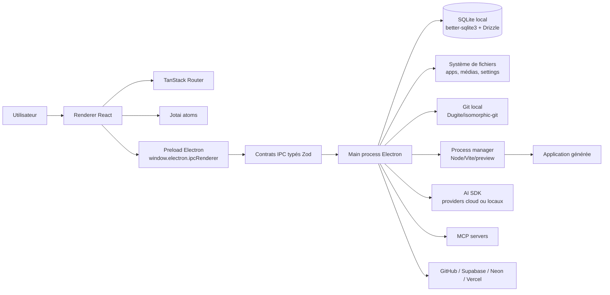
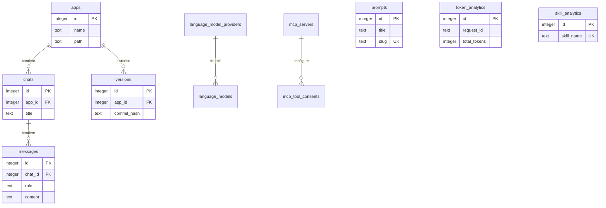

# Architecture système — NeuroCode

## Vue d'ensemble

NeuroCode est une application desktop Electron. Le frontend React tourne dans le renderer, communique avec le preload sécurisé, puis avec le main process via des contrats IPC typés Zod. Le main process orchestre la base SQLite locale, les processus de preview des applications, les intégrations externes et les fournisseurs IA.



Flux principal d'une génération IA :

```text
ChatInput React
  → chatStreamClient.start({ chatId, prompt, attachments })
  → canal IPC chat:stream
  → handler main process
  → assemblage contexte + modèle IA + outils locaux/MCP
  → écritures fichiers / DB / Git
  → événements chat:response:chunk|end|error
  → mise à jour UI, messages, preview et métriques tokens
```

## Frontend

### Structure

- `src/routes/` définit les routes TanStack Router : home, chat, app details, settings, library, hub, media, themes, prompts et token analytics.
- `src/pages/` contient les pages React associées aux routes.
- `src/components/` regroupe les composants de domaine : chat, intégrations, settings, bibliothèque, médias, skills et composants UI.
- `src/atoms/` centralise l'état Jotai pour apps, chat, preview, GitHub, Supabase, modèles locaux, plan, image generation et vues.
- `src/ipc/types/` expose les contrats client générés par domaine pour appeler le main process depuis le renderer.

### Routing

Le routing repose sur `@tanstack/react-router`. La route racine rend `src/app/layout.tsx`, qui enveloppe les pages via `<Outlet />`. Les routes sont déclarées par fichier et composées dans l'arbre de route généré/maintenu par l'application.

### Gestion d'état

- Jotai est utilisé pour l'état UI transversal et les sélections courantes.
- TanStack Query est utilisé pour les données asynchrones et les invalidations côté UI.
- Les contrats IPC fournissent la frontière de typage entre renderer et main process.
- Les événements streaming (`chat:response:*`, `help:chat:response:*`) évitent de bloquer l'UI pendant les réponses IA.

### UI

- React 19, Tailwind CSS 4 et des composants locaux sous `src/components/ui/`.
- Monaco, Lexical, Recharts, React Markdown, Konva et Framer Motion sont utilisés pour l'édition, les entrées riches, les graphiques, le rendu Markdown, les médias/annotations et les transitions.

## Backend / API

NeuroCode n'expose pas d'API HTTP applicative interne détectée. Le backend applicatif est le main process Electron, accessible via IPC.

### Couches applicatives

```text
src/ipc/types/*           # Contrats IPC : channel, input Zod, output Zod
src/ipc/preload/channels  # Whitelist des canaux invoke/receive/stream
src/preload.ts            # Exposition sécurisée au renderer
src/ipc/handlers/*        # Handlers main process par domaine
src/ipc/utils/*           # Services bas niveau : Git, fichiers, providers, MCP, sécurité
src/db/*                  # Persistence SQLite et migrations Drizzle
src/main/*                # Settings, lifecycle Electron, services main process
```

### Middlewares et sécurité IPC

- Les canaux IPC valides sont dérivés des contrats et whitelists dans le preload.
- Les entrées/sorties des canaux sont validées par Zod au niveau des contrats et handlers.
- Les secrets sont stockés dans les settings utilisateur et chiffrés via `electron.safeStorage` lorsque possible.
- Les handlers de sécurité et utilitaires de chemins limitent les opérations dangereuses : blocage de paquets npm non sûrs, vérifications path traversal, socket firewall et consentements MCP/agent.

### Authentification

Il n'y a pas de session HTTP interne. Les authentifications sont des intégrations externes :

- GitHub : OAuth/deep links et tokens stockés localement.
- Supabase et Neon : OAuth/deep links avec tokens par organisation/projet.
- Vercel : token sauvegardé localement.
- Fournisseurs IA : clés API ou paramètres provider stockés localement.
- Dyad Pro / fonctionnalités Pro : handlers dédiés et retour OAuth/deep link.

## Base de données

### Moteur

- SQLite local via `better-sqlite3`.
- ORM et migrations via Drizzle.
- Fichier de base calculé dans le répertoire utilisateur Electron : `sqlite.db`.

### Modèle relationnel simplifié



### Stratégie de migration

- Les migrations SQL sont versionnées dans `drizzle/`.
- Le schéma source est `src/db/schema.ts`.
- Les commandes disponibles sont :
  - `npm run db:generate` pour générer une migration.
  - `npm run db:push` pour pousser le schéma vers la base locale.
  - `npm run db:studio` pour inspecter la base avec Drizzle Studio.

## Services externes

| Service                                     | Rôle dans l'application                                  | Configuration / auth                         |
| ------------------------------------------- | -------------------------------------------------------- | -------------------------------------------- |
| OpenAI                                      | Modèles chat/image via AI SDK                            | Clé API ou settings provider                 |
| Anthropic                                   | Modèles chat via AI SDK                                  | Clé API ou settings provider                 |
| Google AI / Vertex                          | Modèles Gemini et Vertex                                 | Clé API, project/location ou service account |
| OpenRouter                                  | Routage modèles et image generation                      | Clé API/provider settings                    |
| Ollama / LM Studio                          | Modèles locaux                                           | `OLLAMA_HOST` ou détection locale            |
| Azure OpenAI, xAI, Bedrock, Minimax, NVIDIA | Providers IA additionnels                                | Settings provider                            |
| GitHub                                      | Repositories, branches, push/pull, collaborateurs, clone | OAuth/token                                  |
| Supabase                                    | Connexion projet, branches, migration et management      | OAuth par organisation                       |
| Neon                                        | Projets et branches Postgres pour apps générées          | OAuth/token                                  |
| Vercel                                      | Projets et déploiements                                  | Token Vercel                                 |
| MCP servers                                 | Outils externes appelables par l'agent                   | Configuration serveur + consentement outil   |
| PostHog                                     | Télémétrie produit optionnelle                           | Consentement utilisateur                     |

## Décisions d'architecture

| Choix                           | Justification                                                                                                            |
| ------------------------------- | ------------------------------------------------------------------------------------------------------------------------ |
| Electron                        | Permet de manipuler projets, processus, Git, fichiers, DB locale et previews depuis une app desktop multiplateforme.     |
| IPC typé par contrats Zod       | Centralise channel/input/output, réduit les divergences entre renderer et main process et alimente la whitelist preload. |
| SQLite + Drizzle                | Persistance locale simple, portable et migrable sans service serveur obligatoire.                                        |
| React + TanStack Router + Jotai | UI riche, routing typé et état léger adapté à une application desktop interactive.                                       |
| AI SDK multi-provider           | Permet de basculer entre providers cloud, modèles locaux et providers compatibles avec un code applicatif unifié.        |
| Process manager local           | Les apps générées restent exécutables localement, avec preview et logs contrôlés par NeuroCode.                          |
| Intégrations optionnelles       | GitHub, Supabase, Neon et Vercel enrichissent le workflow sans être nécessaires au lancement local.                      |
| Migrations versionnées          | Les évolutions du modèle SQLite restent auditables et reproductibles.                                                    |

> ⚠️ À compléter : aucun document de design architecture formel ou ADR dédié n'a été détecté ; les décisions ci-dessus sont déduites du code, des dépendances et des scripts.
