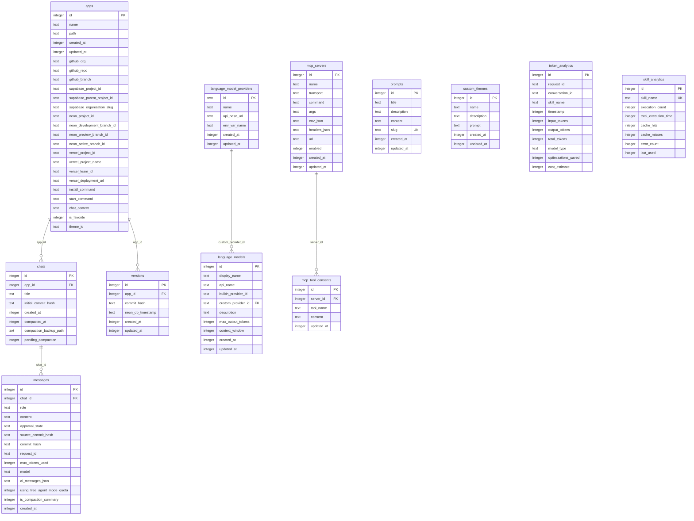

# Schéma de base de données — NeuroCode

NeuroCode utilise SQLite local via `better-sqlite3` et Drizzle ORM. Le schéma source est `src/db/schema.ts`, les migrations versionnées sont dans `drizzle/`, et la base runtime est `sqlite.db` dans le répertoire utilisateur Electron.

## Stratégie de migration

| Élément                     | Valeur                |
| --------------------------- | --------------------- |
| ORM                         | Drizzle ORM           |
| Dialecte                    | SQLite                |
| Schéma source               | `src/db/schema.ts`    |
| Dossier migrations          | `drizzle/`            |
| Commande génération         | `npm run db:generate` |
| Commande application locale | `npm run db:push`     |
| Inspection                  | `npm run db:studio`   |

## Table `prompts`

Prompts réutilisables par l'utilisateur ou l'application.

| Colonne       | Type              | Contraintes                     | Description                       |
| ------------- | ----------------- | ------------------------------- | --------------------------------- |
| `id`          | integer           | PK, autoincrement               | Identifiant du prompt.            |
| `title`       | text              | not null                        | Titre affiché.                    |
| `description` | text              | nullable                        | Description du prompt.            |
| `content`     | text              | not null                        | Contenu complet du prompt.        |
| `slug`        | text              | unique, nullable                | Identifiant lisible/URL-friendly. |
| `created_at`  | integer timestamp | not null, default `unixepoch()` | Date de création.                 |
| `updated_at`  | integer timestamp | not null, default `unixepoch()` | Date de mise à jour.              |

**Relations** : aucune clé étrangère détectée.

**Index / contraintes notables** : `prompts_slug_unique` sur `slug`.

**RLS Supabase** : non applicable, base SQLite locale.

## Table `apps`

Applications locales créées, importées ou gérées par NeuroCode.

| Colonne                      | Type              | Contraintes                     | Description                                             |
| ---------------------------- | ----------------- | ------------------------------- | ------------------------------------------------------- |
| `id`                         | integer           | PK, autoincrement               | Identifiant de l'application.                           |
| `name`                       | text              | not null                        | Nom de l'application.                                   |
| `path`                       | text              | not null                        | Chemin local du projet.                                 |
| `created_at`                 | integer timestamp | not null, default `unixepoch()` | Date de création.                                       |
| `updated_at`                 | integer timestamp | not null, default `unixepoch()` | Date de mise à jour.                                    |
| `github_org`                 | text              | nullable                        | Organisation/propriétaire GitHub associé.               |
| `github_repo`                | text              | nullable                        | Dépôt GitHub associé.                                   |
| `github_branch`              | text              | nullable                        | Branche GitHub courante/associée.                       |
| `supabase_project_id`        | text              | nullable                        | Projet Supabase associé.                                |
| `supabase_parent_project_id` | text              | nullable                        | Projet parent si l'ID Supabase pointe vers une branche. |
| `supabase_organization_slug` | text              | nullable                        | Organisation Supabase utilisée pour les credentials.    |
| `neon_project_id`            | text              | nullable                        | Projet Neon associé.                                    |
| `neon_development_branch_id` | text              | nullable                        | Branche Neon de développement.                          |
| `neon_preview_branch_id`     | text              | nullable                        | Branche Neon de preview.                                |
| `neon_active_branch_id`      | text              | nullable                        | Branche Neon active.                                    |
| `vercel_project_id`          | text              | nullable                        | Projet Vercel associé.                                  |
| `vercel_project_name`        | text              | nullable                        | Nom du projet Vercel.                                   |
| `vercel_team_id`             | text              | nullable                        | Team Vercel.                                            |
| `vercel_deployment_url`      | text              | nullable                        | URL du dernier déploiement Vercel connu.                |
| `install_command`            | text              | nullable                        | Commande d'installation custom.                         |
| `start_command`              | text              | nullable                        | Commande de lancement custom.                           |
| `chat_context`               | text json         | nullable                        | Contexte chat associé à l'app.                          |
| `is_favorite`                | integer boolean   | not null, default `0`           | Marqueur favori.                                        |
| `theme_id`                   | text              | nullable                        | Thème de design associé.                                |

**Relations** : `apps` 1→N `chats`, `apps` 1→N `versions`.

**Index / contraintes notables** : aucune contrainte unique explicite détectée.

**RLS Supabase** : non applicable, base SQLite locale.

## Table `chats`

Conversations liées à une application.

| Colonne                  | Type              | Contraintes                               | Description                            |
| ------------------------ | ----------------- | ----------------------------------------- | -------------------------------------- |
| `id`                     | integer           | PK, autoincrement                         | Identifiant du chat.                   |
| `app_id`                 | integer           | not null, FK `apps.id`, on delete cascade | Application propriétaire.              |
| `title`                  | text              | nullable                                  | Titre du chat.                         |
| `initial_commit_hash`    | text              | nullable                                  | Commit initial associé au chat.        |
| `created_at`             | integer timestamp | not null, default `unixepoch()`           | Date de création.                      |
| `compacted_at`           | integer timestamp | nullable                                  | Date de compaction du contexte.        |
| `compaction_backup_path` | text              | nullable                                  | Chemin de sauvegarde avant compaction. |
| `pending_compaction`     | integer boolean   | nullable                                  | Indique une compaction en attente.     |

**Relations** : N→1 `apps`, 1→N `messages`.

**Index / contraintes notables** : FK cascade sur `app_id`.

**RLS Supabase** : non applicable, base SQLite locale.

## Table `messages`

Messages utilisateur et assistant d'un chat.

| Colonne                       | Type              | Contraintes                                | Description                                          |
| ----------------------------- | ----------------- | ------------------------------------------ | ---------------------------------------------------- |
| `id`                          | integer           | PK, autoincrement                          | Identifiant du message.                              |
| `chat_id`                     | integer           | not null, FK `chats.id`, on delete cascade | Chat propriétaire.                                   |
| `role`                        | text enum         | not null, `user` ou `assistant`            | Rôle du message.                                     |
| `content`                     | text              | not null                                   | Contenu textuel.                                     |
| `approval_state`              | text enum         | nullable, `approved` ou `rejected`         | État d'approbation d'une réponse/action.             |
| `source_commit_hash`          | text              | nullable                                   | Commit du code à la création du message.             |
| `commit_hash`                 | text              | nullable                                   | Commit du code à l'envoi du message.                 |
| `request_id`                  | text              | nullable                                   | Identifiant de requête IA.                           |
| `max_tokens_used`             | integer           | nullable                                   | Maximum de tokens utilisés par le message assistant. |
| `model`                       | text              | nullable                                   | Modèle IA utilisé.                                   |
| `ai_messages_json`            | text json         | nullable                                   | Enveloppe AI SDK v6 pour tool calls/results.         |
| `using_free_agent_mode_quota` | integer boolean   | nullable                                   | Indique l'usage du quota agent gratuit.              |
| `is_compaction_summary`       | integer boolean   | nullable                                   | Indique un résumé de compaction.                     |
| `created_at`                  | integer timestamp | not null, default `unixepoch()`            | Date de création.                                    |

**Relations** : N→1 `chats`.

**Index / contraintes notables** : FK cascade sur `chat_id`.

**RLS Supabase** : non applicable, base SQLite locale.

## Table `versions`

Versions Git/commit associées à une application.

| Colonne             | Type              | Contraintes                               | Description                |
| ------------------- | ----------------- | ----------------------------------------- | -------------------------- |
| `id`                | integer           | PK, autoincrement                         | Identifiant de version.    |
| `app_id`            | integer           | not null, FK `apps.id`, on delete cascade | Application propriétaire.  |
| `commit_hash`       | text              | not null                                  | Hash Git.                  |
| `neon_db_timestamp` | text              | nullable                                  | Timestamp DB Neon associé. |
| `created_at`        | integer timestamp | not null, default `unixepoch()`           | Date de création.          |
| `updated_at`        | integer timestamp | not null, default `unixepoch()`           | Date de mise à jour.       |

**Relations** : N→1 `apps`.

**Index / contraintes notables** : unique `versions_app_commit_unique` sur `(app_id, commit_hash)`.

**RLS Supabase** : non applicable, base SQLite locale.

## Table `language_model_providers`

Providers IA personnalisés configurés par l'utilisateur.

| Colonne        | Type              | Contraintes                     | Description                                      |
| -------------- | ----------------- | ------------------------------- | ------------------------------------------------ |
| `id`           | text              | PK                              | Identifiant du provider.                         |
| `name`         | text              | not null                        | Nom affiché.                                     |
| `api_base_url` | text              | not null                        | URL de base API compatible.                      |
| `env_var_name` | text              | nullable                        | Nom de variable d'environnement pour la clé API. |
| `created_at`   | integer timestamp | not null, default `unixepoch()` | Date de création.                                |
| `updated_at`   | integer timestamp | not null, default `unixepoch()` | Date de mise à jour.                             |

**Relations** : 1→N `language_models` via `custom_provider_id`.

**Index / contraintes notables** : clé primaire textuelle `id`.

**RLS Supabase** : non applicable, base SQLite locale.

## Table `language_models`

Modèles IA custom ou référencés.

| Colonne               | Type              | Contraintes                                                   | Description                     |
| --------------------- | ----------------- | ------------------------------------------------------------- | ------------------------------- |
| `id`                  | integer           | PK, autoincrement                                             | Identifiant du modèle.          |
| `display_name`        | text              | not null                                                      | Nom affiché.                    |
| `api_name`            | text              | not null                                                      | Nom du modèle côté API.         |
| `builtin_provider_id` | text              | nullable                                                      | Provider intégré si applicable. |
| `custom_provider_id`  | text              | nullable, FK `language_model_providers.id`, on delete cascade | Provider custom associé.        |
| `description`         | text              | nullable                                                      | Description du modèle.          |
| `max_output_tokens`   | integer           | nullable                                                      | Limite de sortie.               |
| `context_window`      | integer           | nullable                                                      | Fenêtre de contexte.            |
| `created_at`          | integer timestamp | not null, default `unixepoch()`                               | Date de création.               |
| `updated_at`          | integer timestamp | not null, default `unixepoch()`                               | Date de mise à jour.            |

**Relations** : N→1 `language_model_providers` si `custom_provider_id` est renseigné.

**Index / contraintes notables** : FK cascade sur `custom_provider_id`.

**RLS Supabase** : non applicable, base SQLite locale.

## Table `mcp_servers`

Serveurs Model Context Protocol configurés localement.

| Colonne        | Type              | Contraintes                     | Description                             |
| -------------- | ----------------- | ------------------------------- | --------------------------------------- |
| `id`           | integer           | PK, autoincrement               | Identifiant serveur MCP.                |
| `name`         | text              | not null                        | Nom du serveur.                         |
| `transport`    | text              | not null                        | Transport MCP.                          |
| `command`      | text              | nullable                        | Commande locale pour transport process. |
| `args`         | text json         | nullable                        | Arguments de commande.                  |
| `env_json`     | text json         | nullable                        | Variables d'environnement serveur.      |
| `headers_json` | text json         | nullable                        | Headers HTTP éventuels.                 |
| `url`          | text              | nullable                        | URL serveur.                            |
| `enabled`      | integer boolean   | not null, default `0`           | Activation du serveur.                  |
| `created_at`   | integer timestamp | not null, default `unixepoch()` | Date de création.                       |
| `updated_at`   | integer timestamp | not null, default `unixepoch()` | Date de mise à jour.                    |

**Relations** : 1→N `mcp_tool_consents`.

**Index / contraintes notables** : aucune contrainte unique explicite détectée.

**RLS Supabase** : non applicable, base SQLite locale.

## Table `mcp_tool_consents`

Consentements utilisateur pour outils MCP.

| Colonne      | Type              | Contraintes                                      | Description                              |
| ------------ | ----------------- | ------------------------------------------------ | ---------------------------------------- |
| `id`         | integer           | PK, autoincrement                                | Identifiant du consentement.             |
| `server_id`  | integer           | not null, FK `mcp_servers.id`, on delete cascade | Serveur MCP propriétaire.                |
| `tool_name`  | text              | not null                                         | Nom de l'outil MCP.                      |
| `consent`    | text              | not null, default `ask`                          | Politique : `ask`, `always` ou `denied`. |
| `updated_at` | integer timestamp | not null, default `unixepoch()`                  | Date de mise à jour.                     |

**Relations** : N→1 `mcp_servers`.

**Index / contraintes notables** : unique `uniq_mcp_consent` sur `(server_id, tool_name)`.

**RLS Supabase** : non applicable, base SQLite locale.

## Table `custom_themes`

Thèmes personnalisés définis ou générés par l'utilisateur.

| Colonne       | Type              | Contraintes                     | Description             |
| ------------- | ----------------- | ------------------------------- | ----------------------- |
| `id`          | integer           | PK, autoincrement               | Identifiant du thème.   |
| `name`        | text              | not null                        | Nom du thème.           |
| `description` | text              | nullable                        | Description.            |
| `prompt`      | text              | not null                        | Prompt/source du thème. |
| `created_at`  | integer timestamp | not null, default `unixepoch()` | Date de création.       |
| `updated_at`  | integer timestamp | not null, default `unixepoch()` | Date de mise à jour.    |

**Relations** : `apps.theme_id` peut référencer logiquement un thème, mais aucune FK explicite n'est déclarée.

**Index / contraintes notables** : aucune contrainte unique explicite détectée.

**RLS Supabase** : non applicable, base SQLite locale.

## Table `token_analytics`

Mesures d'utilisation de tokens par requête/conversation/skill.

| Colonne               | Type              | Contraintes                     | Description                          |
| --------------------- | ----------------- | ------------------------------- | ------------------------------------ |
| `id`                  | integer           | PK, autoincrement               | Identifiant analytics.               |
| `request_id`          | text              | not null                        | Identifiant de requête.              |
| `conversation_id`     | text              | nullable                        | Identifiant conversation/chat.       |
| `skill_name`          | text              | nullable                        | Skill associée si applicable.        |
| `timestamp`           | integer timestamp | not null, default `unixepoch()` | Date de mesure.                      |
| `input_tokens`        | integer           | not null                        | Tokens d'entrée.                     |
| `output_tokens`       | integer           | not null                        | Tokens de sortie.                    |
| `total_tokens`        | integer           | not null                        | Total tokens.                        |
| `model_type`          | text              | not null                        | Type/modèle utilisé.                 |
| `optimizations_saved` | integer           | not null, default `0`           | Tokens économisés par optimisations. |
| `cost_estimate`       | integer           | nullable                        | Coût estimé stocké en cents.         |

**Relations** : aucune FK explicite détectée.

**Index / contraintes notables** : `idx_token_analytics_conversation`, `idx_token_analytics_skill`, `idx_token_analytics_timestamp`.

**RLS Supabase** : non applicable, base SQLite locale.

## Table `skill_analytics`

Agrégats d'utilisation et performance des skills.

| Colonne                | Type              | Contraintes           | Description                  |
| ---------------------- | ----------------- | --------------------- | ---------------------------- |
| `id`                   | integer           | PK, autoincrement     | Identifiant analytics skill. |
| `skill_name`           | text              | not null, unique      | Nom unique du skill.         |
| `execution_count`      | integer           | not null, default `0` | Nombre d'exécutions.         |
| `total_execution_time` | integer           | not null, default `0` | Temps total d'exécution.     |
| `cache_hits`           | integer           | not null, default `0` | Hits cache.                  |
| `cache_misses`         | integer           | not null, default `0` | Misses cache.                |
| `error_count`          | integer           | not null, default `0` | Nombre d'erreurs.            |
| `last_used`            | integer timestamp | nullable              | Dernière utilisation.        |

**Relations** : aucune FK explicite détectée.

**Index / contraintes notables** : unique sur `skill_name`.

**RLS Supabase** : non applicable, base SQLite locale.

## Diagramme Mermaid ERD

