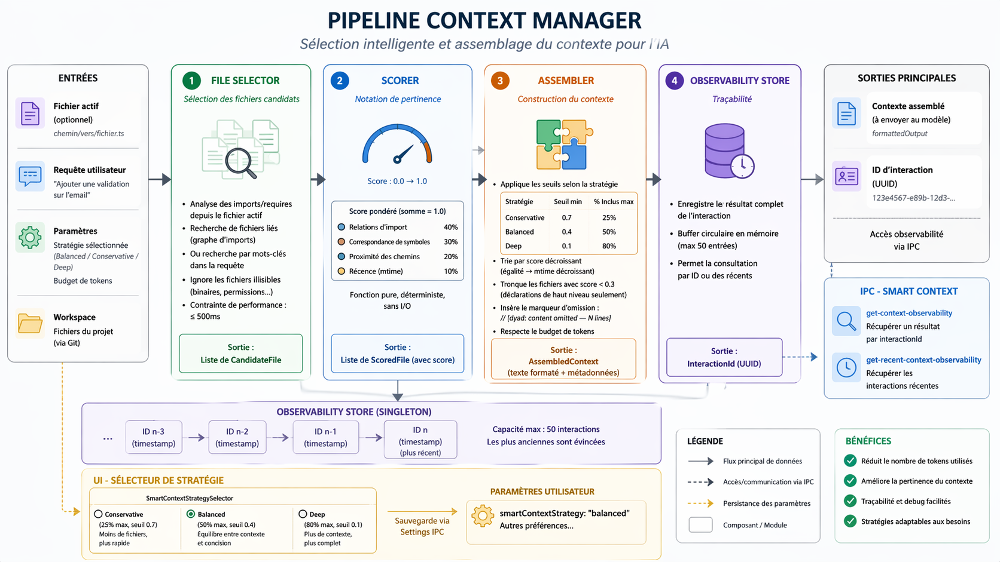

# NeuroCode

<div align="center">


**Générateur d'applications IA gratuit, local et open-source**

[](LICENSE)
[](package.json)
[](package.json)
[](package.json)
[](__tests__/README.md)

[Fonctionnalités](#fonctionnalités) • [Installation](#installation) • [Utilisation](#utilisation) • [Développement](#développement) • [Contribution](#contribution)

</div>

---

## Présentation

NeuroCode est une puissante application de bureau qui permet aux développeurs de créer et de modifier des applications web grâce au développement assisté par l'IA. Basé sur Electron, il offre un aperçu en direct de vos applications tout en effectuant des modifications de code en temps réel, combinant interaction par chat et capacités d'IA autonomes.

### Pourquoi choisir NeuroCode ?

- **🔒 Confidentialité avant tout :** Tout le traitement se fait localement sur votre machine
- **🤖 Support multi-IA :** Fonctionne avec OpenAI, Anthropic, Google, Azure, et bien d'autres
- **⚡ Aperçu en temps réel :** Visualisez instantanément vos changements dans le panneau d'aperçu intégré
- **🎯 Plusieurs modes :** Modes Build, Ask, Plan et Agent Local pour différents flux de travail
- **🛠️ Full Stack :** Intégration Git, gestion de base de données et outils de déploiement
- **🎨 Personnalisable :** Thèmes, modèles et fournisseurs de modèles d'IA personnalisés
- **🧠 Contexte intelligent :** Sélection automatique des fichiers les plus pertinents pour des réponses IA plus rapides et précises

---

## Fonctionnalités

### Capacités de base

#### 🤖 Développement propulsé par l'IA

- **Mode Build :** Génération et modification interactive de code avec aperçu en direct
- **Mode Ask :** Questions-réponses sur votre base de code
- **Mode Plan :** Planification assistée par l'IA et décomposition des tâches avec collecte des besoins
- **Mode Agent Local :** Agent autonome qui exécute des outils et prend des décisions
- **Suggestions IA :** Propositions contextuelles intelligentes (fonctionnalités, corrections, optimisations) basées sur votre projet
- **Optimisation de prompt :** Amélioration automatique des prompts pour de meilleurs résultats IA

#### 💻 Édition de code et aperçu

- Intégration de l'éditeur Monaco avec coloration syntaxique
- Panneau d'aperçu en direct avec modes d'appareils réponsifs (ordinateur, tablette, mobile)
- Modifications de code reflétées instantanément en temps réel
- Support de nombreux types de fichiers et frameworks

#### 🔄 Contrôle de version et Git

- Intégration Git native (compatible Windows)
- Gestion des dépôts GitHub
- Opérations sur les branches et résolution de conflits de fusion
- Suivi des commits et versionnage

#### 🗄️ Intégration de base de données

- **Supabase :** Intégration de base de données PostgreSQL et d'authentification
- **Neon :** Gestion de PostgreSQL Serverless
- Gestion des schémas et migrations
- Exécution de requêtes SQL

#### 🚀 Déploiement et hébergement

- Intégration Vercel pour un déploiement en un clic
- Suivi des URL de déploiement
- Gestion des variables d'environnement
- Support des dossiers d'applications personnalisés

#### 🎨 Personnalisation

- Thèmes générés par l'IA ou création manuelle de thèmes
- Fournisseurs de modèles de langage personnalisés
- Intégration de serveurs Model Context Protocol (MCP)
- Configuration du contexte de chat spécifique à l'application

#### 🖼️ Gestion des médias

- Bibliothèque de médias intégrée pour les ressources d'application
- Capacités de génération d'images par l'IA
- Optimisation et nettoyage des fichiers médias
- Service de médias persistant avec protocole personnalisé

#### 🧩 Système de Skills

- **Création de skills :** Définissez des instructions réutilisables dans des fichiers SKILL.md
- **Invocation par commande slash :** Utilisez `/skill-name` pour invoquer des skills
- **Chargement automatique :** L'IA suggère automatiquement les skills pertinents selon le contexte
- **Skills groupés :** Organisez des skills connexes sous des namespaces
- **Partage de skills :** Partagez des skills au niveau utilisateur ou workspace
- **Skills d'exemple :** Bibliothèque de skills pour workflows courants (revue de code, débogage, tests, etc.)
- **Validation :** Validation automatique du format et de la syntaxe des skills

### 🧠 Contexte Intelligent (Smart Context)

NeuroCode utilise un **Context Manager avancé** pour sélectionner automatiquement les fichiers les plus pertinents de votre projet avant de les envoyer à l’IA.

#### ⚙️ Pipeline

Le système fonctionne en 4 étapes :

1. **File Selector**
   - Analyse les imports et dépendances
   - Recherche par mots-clés si aucun fichier actif

2. **Scorer**
   - Attribue un score de pertinence (0 → 1) basé sur :
     - Relations d’import (40%)
     - Correspondance de symboles (30%)
     - Proximité des fichiers (20%)
     - Récence (10%)

3. **Assembler**
   - Sélectionne les fichiers selon une stratégie :
     - Conservative (précis, rapide)
     - Balanced (équilibré)
     - Deep (contexte large)
   - Tronque automatiquement les fichiers peu pertinents
   - Respecte strictement le budget de tokens

4. **Observability Store**
   - Enregistre chaque interaction
   - Permet d’expliquer pourquoi un fichier a été inclus

#### 🎯 Bénéfices

- Réduction massive du nombre de tokens
- Réponses IA plus pertinentes
- Meilleures performances sur gros projets
- Debug facilité grâce à l’observabilité

#### 🎛️ Stratégies disponibles

| Stratégie        | Description                  |
| ---------------- | ---------------------------- |
| **Conservative** | Très précis, peu de fichiers |
| **Balanced**     | Équilibre (par défaut)       |
| **Deep**         | Contexte large, plus complet |

#### 🔍 Observabilité

Accédez aux décisions du Context Manager :

- Quels fichiers ont été sélectionnés
- Leur score de pertinence
- Pourquoi certains fichiers ont été exclus

Disponible via IPC :

- `get-context-observability`
- `get-recent-context-observability`

#### 📊 Pipeline du Context Manager



### Fonctionnalités avancées

- **Système de Skills :** Créez et gérez des instructions réutilisables pour étendre les capacités de NeuroCode
- **Suggestions IA :** Génération dynamique de propositions d'évolution basées sur le contexte actuel du chat et du projet
- **Optimisation de prompt :** Améliorez automatiquement vos prompts avec l'IA pour obtenir de meilleurs résultats
- **Compactage du contexte :** Résumé automatique des longues conversations
- **Revue de sécurité :** Analyse de sécurité du code par l'IA
- **Correction automatique des problèmes :** Détection et résolution automatique des erreurs
- **Barre de jetons (TokenBar) :** Visibilité en temps réel de la consommation de jetons (activée par défaut)
- **Gestion des jetons :** Gestion intelligente du contexte pour les longs chats
- **Recherche Web :** Recherche sur le web pour des informations à jour
- **Budget de réflexion :** Support des modèles de raisonnement (o1/o3)
- **Contexte intelligent :** Sélection intelligente de fichiers pour le contexte

---

## Fournisseurs d'IA supportés

NeuroCode supporte de nombreux fournisseurs d'IA nativement :

| Fournisseur          | Modèles                          | Type  |
| -------------------- | -------------------------------- | ----- |
| **OpenAI**           | GPT-4, GPT-3.5, o1, o3           | Cloud |
| **Anthropic**        | Claude 3.5 Sonnet, Claude 3 Opus | Cloud |
| **Google**           | Gemini Pro, Gemini Ultra         | Cloud |
| **Google Vertex AI** | Modèles Gemini                   | Cloud |
| **Azure OpenAI**     | GPT-4, GPT-3.5                   | Cloud |
| **Amazon Bedrock**   | Claude, Titan                    | Cloud |
| **XAI**              | Modèles Grok                     | Cloud |
| **OpenRouter**       | Modèles multiples                | Cloud |
| **Ollama**           | Llama, Mistral, CodeLlama        | Local |
| **LM Studio**        | Tout modèle GGUF                 | Local |
| **MiniMax**          | Modèles MiniMax                  | Cloud |

---

## Installation

### Prérequis

- **Node.js** >= 24
- **npm** ou **yarn**
- **Git** (optionnel, inclus avec l'application)

### À partir des sources

```bash
# Cloner le dépôt
git clone https://github.com/dyad-sh/dyad.git
cd dyad

# Installer les dépendances
npm install

# Initialiser les hooks de pré-commit
npm run init-precommit

# Lancer le développement
npm run dev
```

### Générer les installateurs

```bash
# Packager l'application
npm run package

# Créer les installateurs spécifiques à la plateforme
npm run make
```

---

## Utilisation

### Pour commencer

1. **Lancez NeuroCode** et configurez votre clé API de fournisseur d'IA dans les Paramètres (Settings)
2. **Créez une nouvelle application** ou importez un projet existant
3. **Commencez à discuter** avec l'IA pour construire ou modifier votre application
4. **Optimisez vos prompts** en cliquant sur l'icône ✨ pour améliorer automatiquement vos demandes
5. **Visualisez les changements** en temps réel dans le panneau d'aperçu intégré

### Modes de discussion

#### Mode Build (Par défaut)

Génération de code interactive avec exécution d'outils autonome. L'IA peut lire des fichiers, écrire du code et effectuer des modifications directement dans votre projet.

```
Vous : "Crée un formulaire de contact avec des champs nom, email et message"
IA : [Crée le composant formulaire, ajoute la validation, applique le style]
```

#### Mode Ask

Mode questions-réponses pour comprendre votre base de code sans apporter de modifications.

```
Vous : "Comment fonctionne le flux d'authentification ?"
IA : [Explique l'implémentation de l'authentification]
```

#### Mode Plan

Interface de planification collaborative pour des fonctionnalités complexes. L'IA pose des questions de clarification et crée des plans d'implémentation détaillés.

```
Vous : "Je veux ajouter des profils utilisateurs"
IA : [Pose des questions sur les besoins, crée un plan détaillé]
```

#### Mode Agent Local

Agent autonome capable d'exécuter des tâches multi-étapes de manière indépendante avec appels d'outils et prise de décision.

```
Vous : "Refactorise la couche API pour utiliser TypeScript"
IA : [Analyse la base de code, crée un plan, exécute la refactorisation]
```

### Raccourcis clavier

- `Ctrl/Cmd + N` - Nouvelle application
- `Ctrl/Cmd + K` - Nouvelle discussion
- `Ctrl/Cmd + ,` - Paramètres
- `Ctrl/Cmd + R` - Redémarrer le serveur de l'application
- `Ctrl/Cmd + Shift + R` - Reconstruire l'application

### Optimisation de prompt

Cliquez sur l'icône ✨ (sparkles) à côté du champ de saisie pour optimiser automatiquement votre prompt. L'IA analysera votre demande et la reformulera pour :

- La rendre plus spécifique et actionnable
- Ajouter du contexte pertinent si nécessaire
- Décomposer les demandes complexes en étapes claires
- Utiliser un langage technique précis
- Améliorer la clarté tout en conservant votre intention

**Exemple :**

```
Avant : "ajoute un formulaire"
Après : "Crée un formulaire de contact React avec les champs suivants : nom (texte requis), email (validation email requise), message (textarea requis). Ajoute la validation côté client avec des messages d'erreur clairs et un bouton de soumission désactivé jusqu'à ce que tous les champs soient valides."
```

### Suggestions IA

NeuroCode analyse en permanence votre projet pour vous proposer des actions pertinentes. Juste au-dessus du champ de saisie, vous trouverez des suggestions classées par catégories :

- **Fonctionnalités :** Idées de nouvelles fonctions à ajouter.
- **Corrections :** Améliorations de la robustesse ou correction de bugs.
- **Optimisations :** Amélioration du code ou des performances.
- **Améliorations :** UX, design et accessibilité.

Ces suggestions sont générées dynamiquement par l'IA en fonction de votre historique de discussion et sont mises en cache pour une performance optimale.

---

## Développement

### Structure du projet

```
src/
├── main.ts                 # Processus principal Electron
├── preload.ts             # Pont IPC
├── renderer.tsx           # Entrée de l'application React
├── app/                   # Mise en page de l'application
├── components/            # Composants React
├── db/                    # Schéma de base de données
├── ipc/                   # Gestionnaires IPC
├── pages/                 # Composants de pages
├── pro/                   # Fonctionnalités Pro
├── prompts/               # Instructions système IA
└── routes/                # Configuration du routeur
```

### Stack technique

- **Frontend :** React 19, TanStack Router, Jotai, Tailwind CSS
- **Backend :** Electron 40, SQLite, Drizzle ORM
- **IA :** Vercel AI SDK avec support multi-fournisseurs
- **Build :** Vite, Electron Forge
- **Tests :** Vitest, Playwright

### Commandes de développement

```bash
# Lancer le serveur de développement
npm run dev

# Vérification des types
npm run ts

# Linting
npm run lint
npm run lint:fix

# Formatage
npm run fmt

# Exécuter les tests
npm test
npm run e2e

# Opérations sur la base de données
npm run db:generate    # Générer les migrations
npm run db:push        # Pousser les modifications de schéma
npm run db:studio      # Ouvrir Drizzle Studio
```

### Vérifications pré-commit

Avant de committer, lancez :

```bash
npm run fmt        # Formater le code
npm run lint       # Linter le code
npm run ts         # Vérifier les types
```

Ou utilisez la commande automatisée :

```bash
/dyad:lint
```

---

## Configuration

### Paramètres utilisateur

Les paramètres sont stockés dans `user-settings.json` dans le dossier de données de l'application :

- **Sélection du modèle :** Choisissez votre fournisseur d'IA et votre modèle préférés
- **Clés API :** Stockées de manière sécurisée avec le stockage sécurisé d'Electron
- **Modes de discussion :** Configurez le mode par défaut et le mode actuel
- **Gestion du contexte :** Nombre max de tours de discussion, limites de jetons, budget de réflexion
- **Préférences UI :** Thème, langue, niveau de zoom, mode d'appareil
- **Intégrations :** Identifiants GitHub, Vercel, Supabase, Neon
- **Smart Context Strategy :**
  - `balanced` (par défaut)
  - `conservative`
  - `deep`

### Variables d'environnement

Créez un fichier `.env` pour le développement :

```env
# Clés API des fournisseurs d'IA
OPENAI_API_KEY=votre_cle_ici
ANTHROPIC_API_KEY=votre_cle_ici
GOOGLE_API_KEY=votre_cle_ici

# Intégration GitHub
GITHUB_TOKEN=votre_jeton_ici

# Ollama local (optionnel)
OLLAMA_HOST=http://localhost:11434
```

### Serveurs MCP

Configurez les serveurs Model Context Protocol dans `.kiro/settings/mcp.json` :

```json
{
  "mcpServers": {
    "filesystem": {
      "command": "npx",
      "args": [
        "-y",
        "@modelcontextprotocol/server-filesystem",
        "/chemin/vers/fichiers/autorises"
      ]
    }
  }
}
```

### Skills

Les skills sont des instructions réutilisables stockées dans des fichiers SKILL.md :

**Emplacements des skills :**

- **Niveau utilisateur :** `~/.neurocode/skills/` (disponibles uniquement pour vous)
- **Niveau workspace :** `.neurocode/skills/` (partagés avec l'équipe)

**Format d'un skill :**

```markdown
---
name: mon-skill
description: Description brève pour le chargement automatique
---

# Mon Skill

Instructions détaillées pour le skill...

## Instructions

1. Étape un
2. Étape deux
   ...
```

**Utilisation des skills :**

```bash
# Invoquer un skill via commande slash
/mon-skill

# Les skills peuvent aussi être chargés automatiquement selon le contexte
```

**Skills d'exemple disponibles :**

- `/examples:code-review` - Revue de code approfondie
- `/examples:debug-error` - Débogage systématique d'erreurs
- `/examples:write-tests` - Écriture de tests complets
- `/examples:refactor-code` - Refactorisation sécurisée
- `/examples:add-feature` - Ajout de nouvelles fonctionnalités
- `/examples:optimize-performance` - Optimisation des performances

---

## Tests

### Tests unitaires

```bash
npm test              # Exécuter une fois
npm run test:watch    # Mode surveillance
npm run test:ui       # Mode UI
```

### Tests E2E

```bash
# Compiler d'abord (requis !)
npm run build

# Exécuter les tests E2E
npm run e2e
npm run e2e:fast      # Avec moins de tentatives
```

- Tests de propriétés (fast-check) pour garantir :
  - Scores toujours bornés et déterministes
  - Respect du budget de tokens
  - Ordonnancement correct des fichiers
  - Limite mémoire de l’observabilité (50 entrées max)

**Important :** Les tests E2E s'exécutent sur l'application compilée. Recompilez toujours après des modifications de code.

---

## Contribution

Les contributions sont les bienvenues ! Veuillez consulter [CONTRIBUTING.md](CONTRIBUTING.md) pour les directives.

### Flux de développement

1. Forkez le dépôt
2. Créez une branche de fonctionnalité (`git checkout -b feature/ma-super-fonctionnalite`)
3. Apportez vos modifications
4. Lancez les vérifications pré-commit (`npm run fmt && npm run lint && npm run ts`)
5. Committez vos changements (`git commit -m 'Ajout d'une super fonctionnalité'`)
6. Poussez vers la branche (`git push origin feature/ma-super-fonctionnalite`)
7. Ouvrez une Pull Request

### Style de code

- Utilisez TypeScript pour tout nouveau code
- Suivez le style de code existant (appliqué par Oxlint et Oxfmt)
- Écrivez des tests pour les nouvelles fonctionnalités
- Mettez à jour la documentation si nécessaire

---

## Architecture

### Electron IPC

NeuroCode utilise une architecture IPC sécurisée avec :

- **Isolation du contexte :** Activée pour la sécurité
- **Contrats typés :** Tous les points de terminaison IPC ont des contrats TypeScript
- **Gestion des erreurs :** DyadError avec DyadErrorKind pour une classification appropriée
- **Catégories de gestionnaires :** Plus de 30 modules de gestionnaires spécialisés

### Schéma de base de données

Base de données SQLite avec Drizzle ORM :

- **apps :** Métadonnées et intégrations des applications
- **chats :** Sessions de discussion par application
- **messages :** Messages de chat avec réponses de l'IA
- **versions :** Suivi des commits Git
- **prompts :** Instructions et modèles sauvegardés
- **language_models :** Modèles d'IA disponibles
- **mcp_servers :** Configurations des serveurs MCP
- **custom_themes :** Thèmes créés par l'utilisateur

### Gestion de l'état

- **Jotai :** Gestion d'état atomique pour l'état global
- **TanStack Query :** État du serveur et récupération de données
- **État local :** État UI au niveau du composant

---

## Sécurité

NeuroCode prend la sécurité au sérieux :

- **Stockage chiffré :** Clés API stockées avec le stockage sécurisé d'Electron
- **Validation des entrées :** Schémas Zod pour toutes les entrées utilisateur
- **Isolation du contexte :** Le processus de rendu est cloisonné (sandboxed)
- **Revue de sécurité :** Analyse de sécurité du code par l'IA
- **Valeurs par défaut sûres :** Blocage des paquets npm dangereux par défaut

---

## Performance

- **Compactage du contexte :** Résumé automatique pour les longs chats
- **Gestion des jetons :** Limites de contexte et comptage intelligents
- **Chargement différé (Lazy Loading) :** Composants chargés à la demande
- **Défilement virtuel :** Rendu efficace des grandes listes
- **Suivi des performances :** Suivi intégré de la mémoire et du CPU

---

## Dépannage

### Problèmes courants

**L'application ne démarre pas :**

- Vérifiez la version de Node.js (>= 24 requis)
- Supprimez `node_modules` et réinstallez : `npm install`
- Vérifiez les journaux (logs) dans le dossier de données de l'application

**L'aperçu ne se met pas à jour :**

- Cliquez sur le bouton Actualiser au-dessus de la saisie du chat
- Essayez les commandes Redémarrer (Restart) ou Reconstruire (Rebuild)
- Vérifiez la console du navigateur pour les erreurs

**L'IA ne répond pas :**

- Vérifiez la clé API dans les Paramètres
- Vérifiez la connexion internet (pour les fournisseurs cloud)
- Essayez un autre modèle ou fournisseur

**Les opérations Git échouent :**

- Assurez-vous que Git est installé (ou utilisez le Git inclus)
- Vérifiez les permissions du dépôt
- Vérifiez le jeton GitHub si vous utilisez l'intégration GitHub

---

## Licence

Ce projet est sous licence MIT - voir le fichier [LICENSE](LICENSE) pour plus de détails.

---

## Remerciements

- Construit avec [Electron](https://www.electronjs.org/)
- IA propulsée par [Vercel AI SDK](https://sdk.vercel.ai/)
- Composants UI de [Base UI](https://base-ui.com/)
- Éditeur de code par [Monaco Editor](https://microsoft.github.io/monaco-editor/)

---

## Support

- **Documentation :** [docs.dyad.sh](https://docs.dyad.sh)
- **Problèmes :** [GitHub Issues](https://github.com/dyad-sh/dyad/issues)
- **Discussions :** [GitHub Discussions](https://github.com/dyad-sh/dyad/discussions)
- **Bouton d'aide :** Utilisez le bouton d'aide en bas à gauche de l'application

---

<div align="center">

Fait avec ❤️

[⬆ Retour en haut](#neurocode)

</div>
